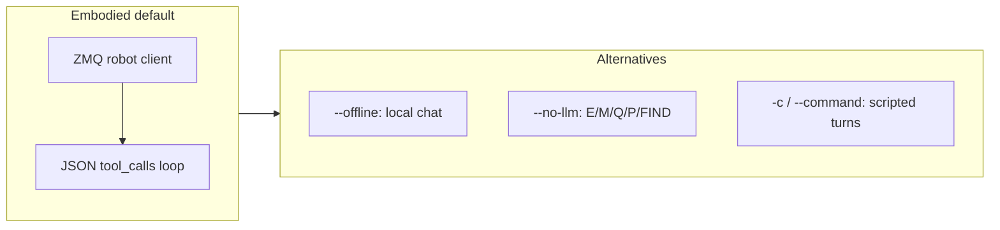

# Running the embodied agent (`emet run agent`)

Canonical entry: **`uv run emet run agent`** (or bare `emet run agent` after `uv sync`). Full flag list: `uv run emet run agent --help`.

## Quick start

**Two terminals** (sim already running):

```bash
# Terminal 1
uv run emet serve mujoco --robot stretch --headless

# Terminal 2 — --robot-ip defaults to 127.0.0.1
uv run emet run agent --robot stretch
```

**One terminal** (spawn sim in-process):

```bash
uv run emet run agent --robot stretch --start-sim -c "describe the scene"
```

See [Simulation configs](sim_configs.md) for `--start-sim`, `--scene`, MolmoSpaces, and Robocasa.

## Modes



| Mode | Flags | Behavior |
|------|-------|----------|
| **Embodied** | (default) | Connect to ZMQ sim/robot; LLM parses natural language into tools (explore, pick, query, …). |
| **Offline chat** | `--offline` | Local LLM only; no ZMQ, no tools, no Discord. Uses `--prompt` builder. |
| **No LLM** | `--no-llm` | Letter commands: `E` explore, `M` pick+place, `Q` question, `P` picture, `FIND x` / `find x`. |
| **Scripted** | `-c` / `--command` | Run one or more turns non-interactively, then exit. **Discord is disabled** automatically (pass `--no-discord` in scripts to silence the warning). |

## Config

- **Default path**: [`configs/emet/default.yaml`](../configs/emet/default.yaml). Override with **`--config`** / **`-C`** or env **`EMET_CONFIG`**.
- **Dot overrides**: **`--set mapping.depth_source=auto`** or **`-O agent.eqa=true`**. See [Unified EMET configuration](emet_config.md).
- **Legacy alias**: **`--agent-config`** (deprecated; use `--config`).
- **Robot**: **`--robot`** optional — resolved from CLI → config `robot:` → ZMQ discovery → connection profile → `stretch`. Must match `emet serve mujoco --robot` when both are explicit. ZMQ discovery is skipped when **`--start-sim`** spawns the sim first.

**Precedence for chat-agent options** (`llm`, `eqa`, `discord`, `device`, `max_tokens`, …): explicit CLI flag → **`--set agent.*`** / YAML `agent:` section → Click default.

| Preset | Robot | Notes |
|--------|-------|-------|
| `configs/emet/default.yaml` | discover / stretch | Unified default |
| `configs/agent_innate_mars.yaml` | innate_mars | DA3 depth overlay |
| `configs/agent_stretch_discord.yaml` | stretch | Heavy embodied + graph preset (flat dynav-style YAML) |
| `configs/agent_rby1_discord.yaml` | rby1 | Same tuning + `sim_config` for Molmo iTHOR |

**Mapping keys** live under **`mapping:`** in config. Reference: [Dynav / mapping configuration](dynav_config.md).

## Models and VRAM

- **Default LLM**: `qwen3-vl-eqa` (Qwen3-VL-8B int4 from mapping `eqa:` config) for chat + head camera on each user turn.
- **`PYTORCH_ALLOC_CONF`**: `emet run agent` sets `expandable_segments:True` before CUDA init unless you already exported `PYTORCH_ALLOC_CONF`.
- **`--eqa`**: opt-in DynaMem EQA on the voxel map (heavy). With **`--share-memory-vllm`** (default), reuses the agent VLM for captions/answers instead of loading a second model.
- **Text-only fallback**: `--llm qwen35-4B` or `qwen35-9B` when VRAM is tight.
- **Vision**: VL models pass robot RGB by default; use **`--no-vl-camera`** to disable.
- **`--device`**, **`--max-tokens`**: apply to embodied and `--offline` modes.

## Simulation (`--start-sim`)

Starts `emet.simulation.mujoco_server` as a subprocess before connecting. Uses `sim:` / `sim_config:` in the agent YAML, **`--sim-config`**, or the packaged default table when none are set.

Common flags (require **`--start-sim`**): `--scene`, `--split`, `--index`, `--install-scene-if-missing`, `--robocasa-task`, `--sim-seed`, `--sim-no-cameras`, `--sim-show-subprocess-output`. Details: [sim_configs.md](sim_configs.md).

## Rerun and Discord

| Feature | Default | Enable / disable |
|---------|---------|------------------|
| **Rerun** | **Off** (unlike `emet run dynamem` / `dynagraph`) | Pass **`--rerun`**; optional **`--headless`**, **`--rerun-native`**, **`--rerun-bind`**. Viewer: `http://localhost:9090?url=ws://localhost:9877` |
| **Discord** | **On** when `DISCORD_TOKEN` is set | **`--no-discord`** to skip; warning if token missing. Terminal and Discord share one input queue when both run. |

Install Discord extra: `uv sync -e discord`.

## Debug flags

| CLI | Env var | Purpose |
|-----|---------|---------|
| `--debug` / `--debug-llm` | — | Full prompt, user input, raw/parsed LLM response |
| `--debug-tools` | `EMET_AGENT_TOOL_DEBUG=1` | Tool call JSON, return strings, executor tuples |
| `--debug-models` | `EMET_AGENT_MODEL_DEBUG=1` | Which models/clients are loaded (+ VRAM snapshots) |
| `--debug-vram` | `EMET_VRAM_DEBUG=1` | nvidia-smi + torch CUDA at load milestones |
| `--debug-camera` | `EMET_AGENT_CAMERA_DEBUG=1` | Head-camera frame stats (black-PNG diagnosis) |

## Examples

```bash
# Offline chat
uv run emet run agent --offline
uv run emet run agent --llm qwen35-9B --offline

# Embodied + Rerun + Discord preset
export DISCORD_TOKEN=...
uv run emet run agent --config configs/agent_stretch_discord.yaml --rerun

# Innate Mars
uv run emet run agent --config configs/agent_innate_mars.yaml

# Load saved memory
uv run emet run agent --input-path logs/memory_xxx --no-discord

# Scripted smoke (no LLM load)
timeout 15 uv run emet run agent --no-llm -c Q --robot stretch

# MolmoSpaces one-liner
uv run emet run agent --robot rby1 --start-sim --scene ithor --headless -c "describe the scene"
```

## Testing

- Config resolution: `uv run emet test src/test/utils/test_resolve_config.py`
- Config loader: `uv run emet test src/test/config/test_emet_config_loader.py`
- VL registry: `uv run emet test src/test/llms/test_qwen_vl_registry.py`
- CLI defaults + agent config precedence: `uv run emet test src/test/cli/test_run_agent_defaults.py`
- Manual: with sim up, `timeout 15 uv run emet run agent --no-llm -c Q --robot stretch`
