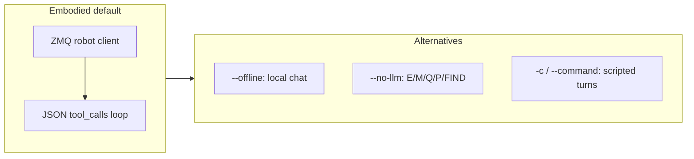

# Running the embodied agent (`emet run agent`)

Canonical entry: **`uv run emet run agent`** (or bare `emet run agent` after `uv sync`). Full flag list: `uv run emet run agent --help`.

## Quick start

**New here?** Follow the guided walkthrough: **[Your first test](first_test.md)** (table + MolmoSpaces prompts).

**Two terminals** (sim already running):

```bash
# Terminal 1
uv run emet serve mujoco --robot stretch --headless

# Terminal 2 — --robot-ip defaults to 127.0.0.1
uv run emet run agent --robot stretch --no-discord --rerun
```

**One terminal** (spawn sim in-process):

```bash
uv run emet run agent --robot stretch --start-sim -c "describe the scene"
```

See [Simulation configs](sim_configs.md) for `--start-sim`, `--scene`, MolmoSpaces, and Robocasa.

## Modes



| Mode | Flags | Behavior |
|------|-------|----------|
| **Embodied** | (default) | Connect to ZMQ sim/robot; LLM parses natural language into tools (explore, pick, query, …). |
| **Offline chat** | `--offline` | Local LLM only; no ZMQ, no tools, no Discord. Uses `--prompt` builder. |
| **No LLM** | `--no-llm` | Letter commands: `E` explore, `M` pick+place, `Q` question, `P` picture, `FIND x` / `find x`. |
| **Scripted** | `-c` / `--command` | Run one or more turns non-interactively, then exit. **Discord is disabled** automatically (pass `--no-discord` in scripts to silence the warning). |

### Skill library vs orchestrator modes

One shared skill library (`emet.agent.skills`); two tool packs:

| Orchestrator mode | Entry | Pack | Stop / answer |
|-------------------|-------|------|----------------|
| **CHAT** | `emet run agent` (Discord / terminal) | `describe_scene`, `explore`, `scan_environment`, Discord send_*, … (metadata in `CHAT_SKILL_SPECS`; funcs bind in `build_chat_tools`) | User turns; explore is turn-blocking |
| **EQA_EPISODE** | Dynagraph / Habitat `run_eqa` when `eqa.agentic_verify`; OVMM find (dynagraph) via same executor | `investigate` / `navigate_to_obs`, `explore_frontier`, `look_around`, `verify_siglip`, `submit_answer` / `finish` (`EQA_SKILL_SPECS`) | VLM-assess answerable → submit (or explore `finish`); detectors are proposals only |

OVMM find questions (`Where is the jar on the counter?`) use the **same** `AgenticEQAExecutor` as HM-EQA — not a parallel find loop. One-shot voxel localize is ablation-only (`--oneshot-localize` / `agentic_find: false`). See [ovmm_find_phase_benchmark.md](ovmm_find_phase_benchmark.md).

`--eqa-eval` still bypasses the chat tool-router and uses the Habitat harness episode path (not CHAT). Do not expect Discord chat turns to score Habitat MCQ. See [evaluation.md](evaluation.md#agentic-grapheqa-verify--offline-tuning) and [agentic_qwen_context.md](experiments/agentic_qwen_context.md#approach-current) (evidence-card recall, frontier retirement).

**Action-outcome ledger (opt-in):** both packs can write structured attempt rows (`navigate` / `verify` / `pick` / `place` / `closer_look`, …) into `GraphEQAMemory` when `eqa.attempt_ledger` / `EMET_EQA_ATTEMPT_LEDGER` is on (default **off** — paper paths unchanged). Shared result shape: `emet.agent.tool_outcome.ToolOutcome`. Operator reference: [attempt_ledger.md](attempt_ledger.md).

### Lifelong reload

CHAT can resume a prior dynagraph export (same layout as `emet run dynagraph --export`, which writes `voxel_map.pkl` by default):

1. **Assume pose is OK** — load graph + `voxel_map.pkl` + `manifest.final_step` into the controller (shared helper `emet.memory.lifelong`).
2. **Optional fudge** — `--refine-start` takes one live frame (if available), estimates a **small** SE(2) alignment of the saved cloud to the live cloud, and applies it to graph + voxel. Large / low-quality alignments are **rejected**; the assumed pose is kept.
3. **Roam** — use existing CHAT tools (`scan_environment`, `explore`). Scan/save writes a full lifelong checkpoint (graph + voxel pickle), not DynaMem-only.

Geometric smoke (no GPU): `uv run python scripts/smoke_lifelong_pose_refine.py`.

## Config

- **Default path**: [`configs/emet/default.yaml`](../configs/emet/default.yaml). Override with **`--config`** / **`-C`** or env **`EMET_CONFIG`**.
- **Connection profile `config`**: when `--config` is omitted, the named (`--connection`) or **active** profile’s `config` path wins over `EMET_CONFIG` / the packaged default — for agent **and** dynamem / dynagraph / stream. See [cli.md](cli.md) (`emet connect`) and [emet_config.md](emet_config.md).
- **Dot overrides**: **`--set mapping.depth_source=auto`** or **`-O agent.eqa=true`**. See [Unified EMET configuration](emet_config.md).
- **Legacy alias**: **`--agent-config`** (deprecated; use `--config`).
- **Robot**: **`--robot`** optional — resolved from CLI → config `robot:` → ZMQ discovery → connection profile → `stretch`. Must match `emet serve mujoco --robot` when both are explicit. ZMQ discovery is skipped when **`--start-sim`** spawns the sim first.

**Precedence for chat-agent options** (`llm`, `eqa`, `discord`, `device`, `max_tokens`, `memory_backend`, …): explicit CLI flag → **`--set agent.*`** / YAML `agent:` section → Click default.

| Preset | Robot | Notes |
|--------|-------|-------|
| `configs/emet/default.yaml` | discover / stretch | Unified default; **`agent.memory_backend: dynagraph`** |
| `configs/agent_innate_mars.yaml` | innate_mars | Discord + EQA captions; DA3 depth overlay; `agent.name: Herman`; `agent.llm: openai` — pass **`--host ORIN_HOST`** (or `EMET_LLM_HOST`) for unified VL-7B on `:8000` text+captions (dual-2b: `--vl-port 8001`); store on profile with `emet connect save … --config configs/agent_innate_mars.yaml` then `emet run agent --connection mars --host ORIN_HOST` |
| `configs/agent_stretch_discord.yaml` | stretch | Discord + instance-graph; add **`--eqa`** for Qwen3-VL captions (recommended for intelligent “what can you see?”) |
| `configs/agent_rby1_discord.yaml` | rby1 | Same tuning + `sim_config` for Molmo iTHOR |

**Memory backend** (`--memory-backend` / `agent.memory_backend`) — **mutually exclusive** object-graph plug-in on the voxel map:

| Value | Controller | Object graph |
|-------|------------|--------------|
| **`dynagraph`** (default) | `DynagraphController` | Dynagraph memory (GraphEQAMemory + merge/staleness) — Discord / paper method |
| `static_graph` (alias `graph_eqa`) | `GraphEQAController` | GraphEQAMemory only (zero-merge baseline; no Dynagraph lifecycle) |
| `open_vocab` | `DynamemController` | OpenVocabSceneGraph only (`emet run scene-graph`) |
| `dynamem` | `DynamemController` | Voxels only (no graph plug-in) |

Nested `embodied_agent.*.enabled` flags are **coerced** from this enum so OpenVocab and GraphEQA are never both live. Tuning (instance graph, fusion, OV config name) still lives under `embodied_agent:`.

**Mapping keys** live under **`mapping:`** in config. Reference: [Dynav / mapping configuration](dynav_config.md).

## Models and VRAM

**Intended split (keep this):**

| Role | Model | Flag / default |
|------|--------|----------------|
| Fast tool router | `qwen35-4B` text | default `--llm` |
| Intelligent vision / memory QA | Qwen3-VL-8B int4 | **`--eqa`** (loads from `eqa:` in mapping config) |

Do **not** put the 8B VL on every chat turn as the router — that made “what can you see?” take a minute just to emit JSON. Pass **`--eqa`** so `describe_scene` / `query_memory` use the larger VLM; keep the 4B for tool selection. With default `--share-memory-vllm` and text `--llm`, the agent materializes a **separate** caption VLM (not shared with the router). Optional one-model mode: `--llm qwen3-vl-eqa --eqa` (slower routing).

- **Default LLM**: `qwen35-4B` (fast tool-router). Loads as **`Qwen3_5ForConditionalGeneration`** int4 with thinking disabled — not the legacy CausalLM pipeline (that path was CPU-bound and multi-minute).
- **`--eqa`**: loads the **larger** caption/EQA VLM (Qwen3-VL-8B int4 from `eqa:`). Needed for intelligent “what can you see?” captions and memory QA. With a VL `--llm` + `--share-memory-vllm`, reuses that one load; with text `--llm`, loads the 8B separately after the router. Works with Dynagraph instance-graph (does not disable YoloE proposals).
- **`--eqa-eval`**: scored HM-EQA episode through the **same** `run_hmeqa_episode` as `emet-habitat` (requires `--habitat-question-id`; optional `--extra-instruction`). Does **not** use the chat tool-router — zero intentional letter loss vs the Habitat harness.
- **Heavy shared VL** (optional): `--llm qwen3-vl-eqa --eqa` — one 8B for chat + captions (slow tool routing).
- **Expected GPU footprint**: SigLIP + detector + `qwen35-4B` alone is lighter; **`--eqa`** adds ~8–12 GiB for the 8B int4. Shared `qwen3-vl-eqa` is typically **~10–14 GiB** total with SigLIP.
- **CPU fallback is an error**: GPU int4 load failures no longer silently fall back to CPU bf16 (that caused multi-minute `*Thinking…*` hangs with high CPU / idle GPU). Set **`EMET_ALLOW_CPU_VLM=1`** only if you intentionally want the slow CPU path.
- **ZMQ stream pause**: while the chat LLM loads or generates, the agent pauses ZMQ JPEG/JP2 decode threads. Loading weights with those threads spinning made HF load ~100× slower and could hang the first `*Thinking…*` turn until streams were paused.
- **Local HF cache**: loads prefer a warm Hugging Face snapshot (no hub “download” when cached). Force offline with **`EMET_HF_LOCAL_ONLY=1`** or **`HF_HUB_OFFLINE=1`**.
- **`PYTORCH_ALLOC_CONF`**: `emet run agent` sets `expandable_segments:True` before CUDA init unless you already exported `PYTORCH_ALLOC_CONF`.
- **Larger text**: `--llm qwen35-9B` when you want a stronger text router (still not a substitute for `--eqa` vision).
- **Vision**: Camera→chat VL is **off by default** (use **`--vl-include-camera`** to enable). Vision questions should use `describe_scene` / `send_image` with **`--eqa`** for the smart captioner.
- **`describe_scene`** (“what can you see?”): **caption the current head image** with the EQA VLM when `--eqa` is on, then **ground with scene-graph / map** labels if available. No auto look-around or explore — use `look_around` / `explore` / `scan_environment` for that. Without `--eqa`, Discord presets fall back to curated detector text (`describe_use_detector_fallback: true`). Always attaches **live head RGB**; usable named object crops may be attached as extras.
- **YoloE thresholds (two knobs):** `detection.confidence_threshold` (~0.02) is for **instance/graph candidate proposals** (high recall). Raising it can hurt find/graph coverage — only change with task metrics. Chat-only tightening uses `detection.describe_confidence_threshold` (default 0.30) when `describe_use_detector_fallback: true`; that does **not** change mapping.
- **RGB size**: ``eqa.vl_image_max_side`` (default **512**) downsamples frames before VL / `describe_scene`. Optional ``eqa.vl_image_max_pixels``. Override with ``--set eqa.vl_image_max_side=384``.
- **`--max-tokens`**: default **256** (tool JSON is short; large values make HF generate crawl).
- **Prefix cache**: with ``eqa.vl_cache_system_prefix`` (default on) for **VL** clients (`qwen3-vl-*`, `qwen35-vlm-*`), the agent warms the system-prompt KV after LLM load. Text ``qwen35-*`` tool-routers keep prefix cache **off** (Qwen3.5 chat template rejects system-only prefills). If VL first turns hang, try **`--no-cache-vl-prefix`**.
- **Attention backend**: Qwen3-VL loads with **Flash-Attn 2** when `flash-attn` is installed, otherwise PyTorch **SDPA** (fast on RTX 40xx). Eager is only for `EMET_ATTN_EAGER=1`. Flash-Attn is optional and must match your torch/CUDA (often no wheel for bleeding-edge torch — SDPA is enough for most agent use). It is **not** a default group: install with **`uv sync --group flash-attn`**, which compiles CUDA kernels against the installed torch and needs a matching CUDA toolkit.
- **Prompt size**: the agent system prompt is ~1k+ tokens (tool list). Status `prompt=1180` is **input** length (prefill), not a decode cap. Decode budget is `--max-tokens` (default 256). Tool JSON usually finishes far earlier if the model stops; slow turns are usually prefill + per-token decode on an 8B VL.
- **Thinking heartbeat**: while the LLM runs, terminal status lines refresh with phase/heartbeat detail (`building prompt`, `still running (Ns) — …`). Discord gets a single `*Thinking…*` line per LLM call (no phase spam / `*Running tools…*`); generate stays on the main CUDA thread.
- **`--device`**, **`--max-tokens`**: apply to embodied and `--offline` modes.

## Skill checklist (interactive)

| Skill | Tool(s) | Pass criteria |
|-------|---------|----------------|
| Describe | `describe_scene` | Caption + optional graph grounding + **live** head photo (no motion) |
| Turn | `rotate_base` | Explicit degrees (180 / ±90 / …) |
| Nudge | `move_forward` | Explicit meters (~0.1 for “a bit”); **map-clipped** (seeds `local_radius` disk if empty; asks to scan/rotate if still blocked); bare “move forward” → ask how far |
| Explore | `explore` | Map cells increase; tool return includes map diagnostic + last-plan summary (clearance / confirm / abort outcomes) |
| Find | `find_objects` | Nav toward known label or clear failure; surfaces `user_cancelled` / `aborted_waypoint_timeout` / `rejected_*` instead of silent success |
| Find after world change (Robocasa) | `find_objects` + invalidate | After ZMQ relocate, memory must not keep a confident waypoint at the **old** pose — use `scripts/smoke_dynagraph_agent_world_change_find.py` |
| Scan | `scan_environment` | Full in-place rotate + map update |
| Share view | `send_image` / describe attach | Live RGB OK |
| Aim wrist (stub) | `aim_arm_at` | Not implemented (IK) — see [TODO.md](../TODO.md); use describe_scene |
| Share map | `send_map_snapshot` | Top-down Discord/Rerun (optionally overlays last motion plan) |
| Nav stuck | `navigation_diagnostics` | Map counts + last-plan / base clearance; pair with `send_map_snapshot` |
| Objects / relations | `list_scene_relations` | Dynagraph / GraphEQA memory; open-vocab only if that plug-in is active |
| Memory QA | `query_memory` | Graph/voxel answer when mapped |
| EQA | `--eqa` (+ optional `--llm qwen3-vl-eqa --share-memory-vllm`) | Caption + query path without a second full VL fight |

Performance gates (text router): LLM tool-routing ~1–2s; `describe_scene` should be **caption + photo** (seconds, no motion). Head sweep (`look_around`) target **&lt; ~15–20s** for 4 soft pans when explicitly requested.

Starts `emet.simulation.mujoco_server` as a subprocess before connecting. Uses `sim:` / `sim_config:` in the agent YAML, **`--sim-config`**, or the packaged default table when none are set.

Common flags (require **`--start-sim`**): `--scene`, `--split`, `--index`, `--install-scene-if-missing`, `--robocasa-task`, `--sim-seed`, `--sim-no-cameras`, `--sim-show-subprocess-output`. Details: [sim_configs.md](sim_configs.md).

## Rerun and Discord

| Feature | Default | Enable / disable |
|---------|---------|------------------|
| **Rerun** | **Off** (unlike `emet run dynamem` / `dynagraph`) | Pass **`--rerun`**; optional **`--headless`**, **`--rerun-native`**, **`--rerun-bind`**. Viewer: `http://localhost:9090?url=ws://localhost:9877` |
| **Discord** | **On** when `DISCORD_TOKEN` is set | **`--no-discord`** to skip; warning if token missing. Terminal and Discord share one input queue when both run. |
| **Nav confirm** | **Off** | **`--confirm-nav`** or **`EMET_CONFIRM_NAV=1`**. Before the base moves, shows the plan on the 2D map (Rerun + Discord PNG) and waits for **y/n** (terminal or Discord). Recommended on the real robot. Scripted `-c` auto-accepts. Cancel / waypoint-timeout / low-clearance rejects appear in `find_objects` / `explore` tool returns so the LLM does not invent success. |

Install Discord extra: `uv sync -e discord`.

## Debug flags

| CLI | Env var | Purpose |
|-----|---------|---------|
| `--debug` / `--debug-llm` | — | Full prompt, user input, raw/parsed LLM response |
| `--debug-tools` | `EMET_AGENT_TOOL_DEBUG=1` | Tool call JSON, return strings, executor tuples |
| `--debug-models` | `EMET_AGENT_MODEL_DEBUG=1` | Which models/clients are loaded (+ VRAM snapshots) |
| `--debug-vram` | `EMET_VRAM_DEBUG=1` | nvidia-smi + torch CUDA at load milestones |
| `--debug-camera` | `EMET_AGENT_CAMERA_DEBUG=1` | Head-camera frame stats (black-PNG diagnosis) |
| `--thinking-status` / `--no-thinking-status` | `EMET_AGENT_THINKING_STATUS=1/0` | Status while waiting (default: on). Terminal: Thinking phases + tool chatter. Discord: one Thinking line per LLM call; for long actions (`explore`, `scan_environment`, …) also `*Exploring…*` / progress (`*Look around: sweeping head*`). |
| — | `EMET_AGENT_MOTION_STATUS=1/0` | Fine-grained **terminal** motion progress during head sweeps / rotate-in-place / explore steps (default: on). Discord stays coarse (start + mid/end). |
| `--confirm-nav` / `--no-confirm-nav` | `EMET_CONFIRM_NAV=1` | Gate motion plans behind y/n + map preview (see table above) |
| `--cache-vl-prefix` / `--no-cache-vl-prefix` | `EMET_VL_CACHE_SYSTEM_PREFIX=1/0` | Reuse system-prompt KV on Qwen3-VL agent turns (default: on via `eqa.vl_cache_system_prefix`) |

Terminal-only timing lines use a ``[HH:MM:SS]`` prefix (user turn, LLM done + duration, tools done + duration, turn total). Discord messages stay untimestamped.

## Examples

```bash
# Offline chat
uv run emet run agent --offline
uv run emet run agent --llm qwen35-9B --offline

# Embodied + Rerun + Discord preset
export DISCORD_TOKEN=...
uv run emet run agent --config configs/agent_stretch_discord.yaml --eqa --rerun

# Real robot: preview motion plans on the map, confirm y/n (terminal or Discord)
uv run emet run agent --robot stretch --robot-ip <IP> --confirm-nav --rerun
# or: EMET_CONFIRM_NAV=1 uv run emet run agent --robot stretch --robot-ip <IP> --rerun

# Innate Mars — Discord chat + explore (bridge must be up)
export DISCORD_TOKEN=...
# Preset: agent.llm openai + remote Orin via --host (docs/llm_serve.md); optional --rerun
uv run emet run agent --connection mars --host ORIN_HOST
# Profile should store --config configs/agent_innate_mars.yaml (persona name in YAML).
# Hardware checklist: docs/robots/innate_mars_hardware.md#discord-chat--explore
# Note: explore is turn-blocking — Discord messages queue until the tool finishes.

# Load saved Dynagraph memory (graph.json + voxel_map.pkl; restores staleness clock)
uv run emet run agent --input-path logs/memory_xxx --no-discord

# Same, but estimate a small SE(2) fudge vs a live frame (imperfect spawn). On failure, keep assumed pose.
uv run emet run agent --input-path logs/memory_xxx --refine-start --no-discord

# Lifelong dirs store the **active** plug-in only: dynagraph/static_graph → ``graph.json`` (+ voxels);
# ``open_vocab`` → ``open_vocab_scene_graph/``. Legacy dual dirs still load; the inactive sidecar is ignored.
# (On-disk / CLI still accept legacy ``graph_eqa`` as an alias for ``static_graph``.)

# Geometric refine smoke (no GPU): recover a known xy/yaw fudge
uv run python scripts/smoke_lifelong_pose_refine.py

# Scripted smoke (no LLM load)
timeout 15 uv run emet run agent --no-llm -c Q --robot stretch

# Habitat HM-EQA via the **same** episode function as emet-habitat (no chat tool-router; zero intentional loss)
uv run emet run agent --eqa-eval --habitat-question-id 17 --eqa-eval-mock-llm \
  --extra-instruction "Answer with a single letter A–D."
# Real VLM (GPU): omit --eqa-eval-mock-llm; requires .venv-habitat / emet_habitat

# MolmoSpaces one-liner
uv run emet run agent --robot rby1 --start-sim --scene ithor --headless -c "describe the scene"

# MolmoSpaces + rby1 mobile manip (default agent.manip_mode=teleport when server
# advertises sim_set_body_pose; override with --set agent.manip_mode=kinematic)
uv run emet run agent --robot rby1 --start-sim --scene ithor --headless --no-discord \
  -c "pick up the bowl and place it on the microwave"

# Stretch MuJoCo: without -V, pick/place uses GT teleport when sim_set_body_pose
# is advertised. Pass --visual-servo / -V to keep AnyGrasp visual-servo.
uv run emet run agent --robot stretch --start-sim --scene robocasa --headless --no-discord \
  -c "pick up the object and place it in the cabinet"
uv run emet run agent --robot stretch --start-sim --scene robocasa --visual-servo --headless --no-discord \
  -c "pick up the object and place it in the cabinet"

# No LLM / no models: scripted agent tool_calls + teleport only
uv run python scripts/scripted_sim_pick_place.py --start-sim
uv run python scripts/scripted_sim_pick_place.py --start-sim \
  --sim configs/sim/molmospaces_ithor_train_0.yaml \
  --object bowl --receptacle microwave
```

**OVMM full** (`scripts/eval_ovmm_full.py --manip-mode sim|oracle|…`) is a **different** knob from chat `agent.manip_mode` — see [ovmm_full_benchmark.md](ovmm_full_benchmark.md#ovmm---manip-mode--chat-agentmanip_mode) and [motion_planning.md](motion_planning.md#two-manip_mode-namespaces).

## Testing

- Config resolution: `uv run emet test src/test/utils/test_resolve_config.py`
- Config loader: `uv run emet test src/test/config/test_emet_config_loader.py`
- VL registry: `uv run emet test src/test/llms/test_qwen_vl_registry.py`
- CLI defaults + agent config precedence: `uv run emet test src/test/cli/test_run_agent_defaults.py`
- Map frame / snapshot: `uv run emet test src/test/visualization/test_map_snapshot.py`
- Shared EQA compose: `uv run emet test src/test/eval/test_eval_stack.py`
- Manual: with sim up, `timeout 15 uv run emet run agent --no-llm -c Q --robot stretch`
