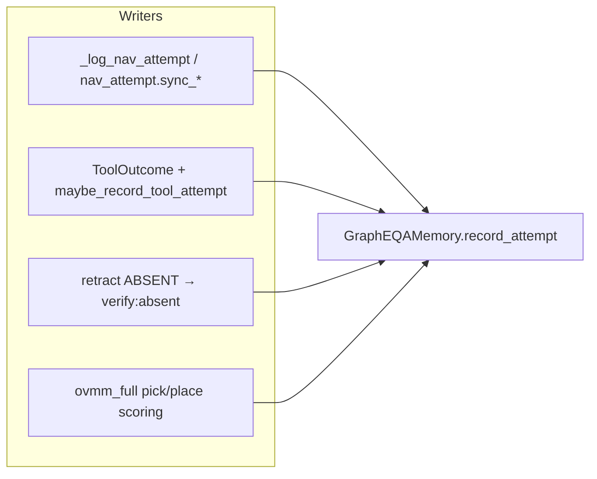

# Action-outcome ledger (agent world model)

**Branch:** `feature/graph-room-evidence`
**Plan:** [plans/2026-08-08_embodied_agent_planning.md](plans/2026-08-08_embodied_agent_planning.md)
**Status:** Phases 1–4 landed (default **off**); a manifest-locked action-history
visibility A/B is available for HM-EQA.

The scene graph already answers “what is where?”. The **attempt ledger** adds “what did we try, and how did it go?” so CHAT tools, agentic EQA, and OVMM manip paths can avoid repeating failed nav / verify / pick / place / closer-look actions.

This page is the **operator and developer reference**. The plan doc is the design history and phase checklist.

---

## Guardrails (paper paths)

| Invariant | Detail |
|-----------|--------|
| **Default off** | No durable `AttemptRecord` rows or dedicated action-history section unless the ledger is enabled. World-evidence provenance may still mirror tool outcomes, but grounded state filters those events unless mode is `agent`. |
| **Pinned configs unchanged** | [`configs/benchmarks/dynagraph.yaml`](../configs/benchmarks/dynagraph.yaml) does not enable the ledger. |
| **EQA tool names frozen** | `investigate`, `explore_frontier`, `verify_siglip`, `submit_answer`, … stay stable for traces. |
| **`eqa.agentic_verify` default** | Still **false**; ledger does not turn on the agentic loop. |
| **Node nav counters remain** | `GraphNode.nav_attempts` / `nav_failures` / `last_nav_note` always update; ledger is an opt-in dual-write. |

---

## Enable

### Grounded Graph Agent visibility modes

`eqa.attempt_ledger_mode` is the paper-facing switch:

| Mode | Collect durable rows | Expose dedicated action history to `grounded_v2` |
|------|----------------------|--------------------------------------------------|
| `off` (default) | no | no |
| `shadow` | yes | no |
| `agent` | yes | yes |

`agent` exposes recent action outcomes, navigation-loop flags, per-place attempt
summaries/failure risk, global attempt rows, and their mirrored provenance events.
`shadow` writes the same ledger and bundle artifact but leaves those channels out
of the router state. Room timeline and live approach-affordance fields remain
controlled by their own axes; this switch does not erase internal safety state.

### Env

```bash
export EMET_EQA_ATTEMPT_LEDGER_MODE=agent  # off | shadow | agent
# optional:
export EMET_ATTEMPT_LEDGER_MAX=512
export EMET_ATTEMPT_LEDGER_PERSIST_ABSENT=0   # keep ABSENT claim blacklist across questions
```

`EMET_EQA_ATTEMPT_LEDGER=1` remains the legacy boolean write gate. HM-EQA
derives it from the selected mode (`shadow` and `agent` both write).

### YAML

Under `eqa:` (mapping / dynav config) or unified `mapping.eqa` / top-level `eqa:`:

```yaml
eqa:
  attempt_ledger_mode: agent  # off | shadow | agent
```

The lower-level boolean/mapping form remains available for non-HM-EQA writers:

```yaml
eqa:
  attempt_ledger:
    enabled: true
    max_records: 512
    persist_absent_claims: false
```

CLI override example:

```bash
uv run emet run agent --set eqa.attempt_ledger=true
```

For a frozen HM-EQA comparison, use the checked-in complete variant files:

```bash
uv run emet hmeqa h2h OUT_SHADOW \
  --variant-config configs/benchmarks/hmeqa_action_history_shadow.yaml \
  --preset paper-router --arms agentic --ids 6,11,12,47
uv run emet hmeqa h2h OUT_AGENT \
  --variant-config configs/benchmarks/hmeqa_action_history_agent.yaml \
  --preset paper-router --arms agentic --ids 6,11,12,47
```

The loader rejects missing or unknown variant axes. Explicit CLI variant flags
win over the file; the effective values plus the variant file path and SHA-256
source label are frozen in `run_manifest.json`. Resume reuses that manifest
rather than re-reading a mutable config.

See [emet_config.md](emet_config.md) and [environment_variables.md](environment_variables.md).

---

## Data model

`AttemptRecord` (`emet.memory.graph_eqa.attempt_ledger`):

| Field | Meaning |
|-------|---------|
| `action_kind` | `navigate` \| `investigate` \| `verify` \| `closer_look` \| `pick` \| `place` \| `explore` |
| `outcome` | `ok` \| `failed` \| `aborted` \| `absent` \| `unreachable` \| `candidate` \| `present` |
| `status_code` | Stable code (`no_path`, `timeout`, `controller_failed`, …) or short free-form |
| `note` | Human/debug string (truncated) |
| `step` | Episode / tool round when known |
| `target_node_id` / `obs_id` / `xyz` | Where the attempt aimed (JSON-friendly xyz tuple) |
| `phrase` | Text query when relevant |
| `source` | `chat` \| `eqa` \| `unknown` |
| `question_id` | Optional episode question id |
| `room` | Canonical room label when known (**schema v2**); empty on v1 imports |

Stored on `GraphEQAMemory` (`_attempt_records`), capped by `max_records` (default 512). Export `schema_version` is **2**.

### Room timeline (graph history)

Separate from classic EQA prompt `HISTORY:` (answer-iteration scrap). `GraphEQAMemory` keeps a capped `_room_events` list (`stamp`, `verify_absent`, `coverage_closed`, …) with `step` + `room`. It survives room-cluster rebuilds, clears on new agentic episode / `clear_eqa_working_memory`, and is **not** gated on the ledger opt-in.

| Method | Role |
|--------|------|
| `record_room_event(...)` | Append when room is a known label (never invents `unknown`) |
| `format_room_history(...)` | Newest-first compact line for agentic `build_state_message` |
| `clear_room_events()` | Drop timeline |

Agentic writers: investigate room-stamp → `stamp`; close ABSENT retract → `verify_absent` (+ ledger `room=` when on); place coverage → `closed` → `coverage_closed`. **Do not** enable investigate stamps on paper-router by default (letter regression). For A/Bs, set `EMET_EQA_ROOM_STAMP_INVESTIGATE=1` / `EMET_EQA_ATTEMPT_LEDGER=1` explicitly — see [experiments/graph_room_evidence.md](experiments/graph_room_evidence.md). This is **agent-visible memory**, not a nav/escape latch.

**Experiment ladder:** [experiments/graph_room_evidence.md](experiments/graph_room_evidence.md) (smoke → rooms probe → wrong-room dwell metrics → optional scale).

### API on `GraphEQAMemory`

| Method | Role |
|--------|------|
| `record_attempt(...)` | Append one row (no-op when ledger off, unless `force=True`); optional `room=` |
| `get_attempt_records()` | Ordered list (oldest first) |
| `export_attempt_ledger()` / `import_attempt_ledger(...)` | Serialize / restore |
| `clear_attempt_ledger()` | Drop rows |
| `attempt_summary_for_obs(obs_id)` | Compact `[attempts: …]` bits for place cards |
| `set_attempt_ledger_question_id(...)` | Tag subsequent rows with a question id |
| `record_nav_attempt(...)` | Always updates node counters; dual-writes a `navigate` row when ledger on |
| `record_room_event` / `format_room_history` | Room-scoped timeline (see above) |

Helpers:

- `infer_nav_status_code` / `infer_nav_outcome` — note → status/outcome
- `summarize_repeat_failures` / `record_manip_attempt` — [`attempt_metrics.py`](../src/emet/memory/graph_eqa/attempt_metrics.py)

---

## Who writes



| Path | Module | Notes |
|------|--------|-------|
| Base navigation | `emet.controller.nav_attempt` ← `DynamemController._log_nav_attempt` | Structured `NavAttemptResult.status_code`; single write path (agentic avoids double-write) |
| CHAT tools | `emet.agent.loop` → `ToolOutcome` → `maybe_record_tool_attempt` | Maps tool names → `action_kind` |
| EQA_EPISODE tools | `agentic_eqa.handle_tool` → same `ToolOutcome` path | `source="eqa"` |
| Verify ABSENT | `retract_phrase_claim_at_obs` | Ledger row `verify` / `absent`; claim blacklist cleared per question unless `persist_absent_claims` |
| Closer look | CHAT `aim_arm_at` → `closer_look.aim_wrist_at_phrase` | Failures become ledger `closer_look` via tool outcome |
| OVMM full manip | `emet.eval.ovmm_full` | After GT-scored pick/place (`sim` / `attempt`) |
| Stretch manip truth | `DynamemTaskExecutor._pickup` / `_place` | Propagates `agent.manipulate` / `agent.place` / `GraspObjectOperation.was_successful` (no more unconditional `True`) |

Shared tool result shape: [`emet.agent.tool_outcome.ToolOutcome`](../src/emet/agent/tool_outcome.py) (`ok`, `status`, `note`, `payload`).

---

## Who reads (surfaces)

| Surface | When ledger on |
|---------|----------------|
| Agentic place cards | `[attempts: navigate:failed(no_path), …]` via `attempt_summary_for_obs` |
| CHAT `navigation_diagnostics` | Recent attempts in the tool payload |
| CONFIRMED_MEMORY / prompt tags | Compact `attempts:` suffixes (respects prompt token budget) |
| Repeat-failure metrics | `summarize_repeat_failures(records)` for offline / future eval reports |

**Repeat key** (Phase 4): same `action_kind` and (`target_node_id` if set, else `obs_id`, else planar `xyz` within **0.25 m**); prior row `outcome` not `ok`. Metrics: `n_repeat_failures`, `n_wasted_rounds`, `by_kind`.

---

## Motion / closer look

- Nav status vocabulary: [`nav_attempt.py`](../src/emet/controller/nav_attempt.py) + [`habitat_nav.NavAttemptResult`](../src/emet/controller/habitat_nav.py).
- Wrist aim: [`closer_look.aim_wrist_at_phrase`](../src/emet/controller/manipulation/closer_look.py) (localize + kinematic EE aim when available). See [motion_planning.md](motion_planning.md).
- **CHAT chain:** successful `aim_arm_at` records a one-shot grant on the agent/context; `take_ee_picture` **refuses** without that grant and **consumes** it on capture. Prefer `face_toward` + `describe_scene` when aim is unavailable.

CHAT vs EQA packs stay disjoint — see [AGENT_RUN.md](AGENT_RUN.md#skill-library-vs-orchestrator-modes). `aim_arm_at` is CHAT-only; EQA uses `investigate` / `look_around`.

---

## Router prompt hygiene

Agentic format blocks in [`agentic_tools.py`](../src/emet/memory/graph_eqa/agentic_tools.py) share `_EQA_RULE_*` atoms so canonical vs `room_policy=llm` variants do not drift. **Byte-stability** of `build_graph_eqa_system_prompt` is required for Qwen3-VL system-prefix KV cache hits — pinned SHA256 + identity checks in `src/test/memory/test_room_policy.py`. Do not casually edit the composed format strings.

---

## Tests

```bash
uv run emet test src/test/memory/test_attempt_ledger.py \
  src/test/memory/test_attempt_metrics.py \
  src/test/agent/test_tool_outcome.py \
  src/test/controller/test_nav_attempt.py \
  src/test/controller/test_closer_look.py \
  src/test/controller/test_dynamem_sim_manip_gating.py \
  src/test/agent/test_skill_packs.py \
  src/test/memory/test_room_policy.py -q

uv run emet test agent-regression -q --no-sim
```

GPU A/B (ledger on vs off) must use `uv run emet jobs run …` — never inline Habitat/VLM in an agent turn. See [evaluation.md](evaluation.md) and `.cursor/rules/gpu-eval-workflow.mdc`.

---

## Code map

| Piece | Path |
|-------|------|
| Record + infer helpers | `src/emet/memory/graph_eqa/attempt_ledger.py` |
| Repeat / manip helpers | `src/emet/memory/graph_eqa/attempt_metrics.py` |
| Store + dual-write | `src/emet/memory/graph_eqa/graph_memory.py` |
| ToolOutcome | `src/emet/agent/tool_outcome.py` |
| Nav sync | `src/emet/controller/nav_attempt.py` |
| Closer look | `src/emet/controller/manipulation/closer_look.py` |
| OVMM writers | `src/emet/eval/ovmm_full.py` |
| Stretch success | `src/emet/controller/task/dynamem/dynamem_task.py` |
| Living checklist | [TODO.md](../TODO.md) (Embodied agent planning) |

---

## Related docs

- [AGENT_RUN.md](AGENT_RUN.md) — CHAT vs EQA_EPISODE
- [graph_eqa.md](graph_eqa.md) / [dynagraph.md](dynagraph.md) — memory backends
- [ovmm_full_benchmark.md](ovmm_full_benchmark.md) — pick/place scoring + ledger hooks
- [motion_planning.md](motion_planning.md) — base + arm planners
- [emet_config.md](emet_config.md) / [environment_variables.md](environment_variables.md) — knobs
