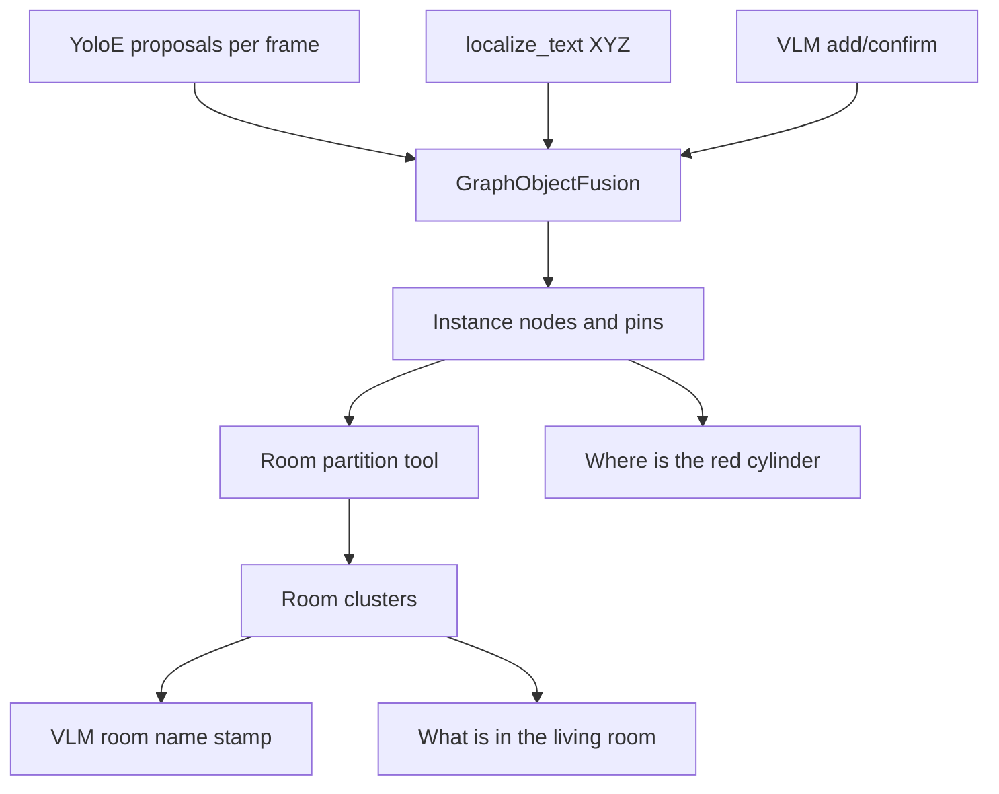

# Dynagraph: DynaMem navigation + GraphEQA graph lifecycle

**Dynagraph** is the same runtime stack as [GraphEQA](graph_eqa.md) (DynaMem-style **sparse voxel map** for navigation and exploration, plus **graph-based EQA memory** in `emet.memory.graph_eqa`), with optional **spatial merge** of nearby nodes that share the same primary label and **staleness pruning** of nodes that have not been reinforced recently.

Use it when you want GraphEQA-style prompts and task images, but also want a simple discrete-time lifecycle on graph nodes (similar in spirit to object aging in dense mapping stacks, without replacing the full [open-vocab scene graph](simulation.md) path used by DynaMem instance mode).

**Paper contrast:** the zero-merge GraphEQA-inspired eval row is **`static_graph`** (not this product default). Shared ids: [paper_benchmarks.md § Shared memory backends](paper_benchmarks.md#shared-memory-backends).

**CLI:** Run from the project root with **`uv run emet run dynagraph …`** (or activate `.venv` first). See [TESTING.md](TESTING.md#run-from-this-repo) if flags like **`--explore-loop`** are missing from `--help`.

**Interactive agent:** `emet run agent` defaults to **`--memory-backend dynagraph`** (same controller stack + interactive merge/staleness). See [AGENT_RUN.md](AGENT_RUN.md).

**Action-outcome ledger (opt-in):** same `GraphEQAMemory` store as GraphEQA — enable with `eqa.attempt_ledger` / `EMET_EQA_ATTEMPT_LEDGER` (default **off**). See [attempt_ledger.md](attempt_ledger.md).

**Rerun (live Dynagraph):** Enabled **by default** (unlike `emet run agent`, which needs **`--rerun`**). Use **`--no-rerun`** to disable. Optional: **`--headless`**, **`--rerun-native`**, **`--rerun-bind`**, **`--rerun-show-panels`**. Verify flags: `uv run python -m emet.app.run_dynagraph --help`.

The main **3D View** uses a **fixed world origin** (`origin=world`; see [rerun.md](rerun.md)) so the voxel map (`world/point_cloud`, `world/obstacles`, `world/explored`), boxes, and dynagraph nodes do not spin when the robot turns. **Not streamed live:** full graph tree text (`print_memory` / old “Dynagraph graph” panel — use `--export` or stdout). **Graph edge lines** and **per-node crop images/mosaic** are also off by default (`rerun.dynagraph` in dynav YAML). Tune load via `rerun.voxel_map_stride`, `rerun.mjcf_mesh_stride`, etc.

## Method

The LLM decides. Python supplies **tools**, **structured outputs**, and **swappable prompt packs**. OVMM locate, Habitat MCQ EQA, and open-ended explore share the same EQA tool names (`inspect_graph`, `investigate`, `explore_frontier`, `verify_siglip`, `submit_answer`). `vlm_assess` is the assess JSON produced **inside** `verify_siglip` after a closer look — not a separate tool (traces keep `verify_siglip`). Swap the prompt, not the finder. Do not fork `if ovmm:` policy in Python, and do not pin episode YAML phrases in `emet ovmm find`.

CHAT vs EQA_EPISODE packs stay disjoint ([AGENT_RUN.md](AGENT_RUN.md)). OVMM vs HM-EQA stay the **same EQA pack**. Interactive `emet run agent` is CHAT (`query_memory` / `face_toward`) and calls the same `localize_text` helper — it does not use `inspect_graph`.

| We provide | The LLM uses |
|------------|--------------|
| Tools (stable names) plus metric helpers they call (`localize_text`, close-map stay, `room_clustering.partition`) | Which tool, which observation, when to explore or answer |
| Structured outputs: graph inventory, voxel/graph proposals, `ViewAssessment` JSON | The next belief and the answer |
| Prompt packs (locate / MCQ / open explore / CHAT) | Same tools, different instructions |

Geometry (voxels, fusion, [close-map](close_map.md), room partition) is **evidence**, not a second policy.

### Query vs closer look

`inspect_graph` is the query for **where do you see X, and how well does voxel/SigLIP match**. It does not move. Classic HM-EQA `query_answer` prompts do **not** duplicate close-map as a `CLOSE_LOOK_STATUS` block (that dump correlated with confident-wrong “None”). Geometry stays on the voxel [close-map](close_map.md) and on catalog rows.

| Tool | Motion? | What it is |
|------|---------|------------|
| `inspect_graph` | No | Query catalog. **Proposals** (`kind=proposal`, `source=voxel`, `obs_id < 0`) are metric `localize_text` XYZ. **Views** (`kind=view`) are graph observations. Each row carries match quality (`yoloe_hit`, `siglip_sim` / `confidence`) and, when the map exists, compact `close_map: {resolved, aimed, min_cam_m}`. Ranking only — not the answer. A view whose XYZ is the current camera pose is not the object. |
| `investigate` | Yes | Closer look: drive to a listed handle, capture a **new** RGB, then `verify_siglip` / `vlm_assess` **that** frame (not the card id). |
| `explore_frontier` | Yes | Map coverage. On **open locate / close-look** (including close-look MCQ), refused while an unused proposal remains (`DETECTIONS_REMAIN`). **Location MCQ** (`Where is X? A) kitchen B) bath`) may still explore to change rooms — a keyword voxel in this room is not a pin. Same EQA pack; question shape, not an OVMM YAML name. |

Close-look **required** is predicted from the **task**: per-episode `extract_target_from_question` (`requires_close_look`) **OR** count/clock/state keywords, so a VLM false-negative cannot disable stay / `DETECTIONS_REMAIN` on “how many” / “what time”. `EMET_EQA_AGENTIC_CLOSE_LOOK=0` turns the classifier off.

Nearby-investigate and the deterministic fallback rank unused proposals above mapping-pose views. Camera-pose `investigate` is refused (`CAMERA_POSE_PLACE`) for locate **and** MCQ. Close-map **stay** keeps the robot on a card XY until an aimed look ≤ 0.55 m or escape. Each answer episode **starts** with `inspect_graph`.

Classic `query_answer` SCENE_GRAPH uses `ATTACHED_INDEX` (Image 1..K ↔ obs id) and `[graph obs N]` tags for navigation handles — not `[Image {obs_id}]`. **Classic gates (AB default, `src/emet/memory/graph_eqa/eqa/graph_answer.py:630`):** `A` location `missing_find` mirrors count (q47 `wall clock` needs an unattached FIND view before confident), `B` voxel `close_map resolved` (`src/emet/mapping/close_map.py:1` `R_M 0.55` `min_cam`/`aimed`) stabilizes `q47/q86` to `7/15` (`6/15` A alone, `5/15` C `img strict` off). Env ablations: `EMET_EQA_LOCATION_MISSING_FIND=0`, `EMET_EQA_CLOSE_MAP_GATE=0`, `EMET_EQA_IMG_STRICT=1` ([environment_variables.md](environment_variables.md)). Tunable knobs: [countclock_bisect.md](experiments/countclock_bisect.md#tuning-ladder-one-knob-at-a-time).

### One EQA step

```mermaid
flowchart TD
  rgbD[RGB-D capture] --> voxel[DynaMem voxel field]
  rgbD --> graph[Graph nodes]
  voxel -->|"localize_text"| catalog[inspect_graph catalog]
  graph -->|"views + pins"| catalog
  q[Question] --> vlm[VLM step]
  catalog --> vlm
  rgbNow[Current RGB] --> vlm
  vlm -->|"pick proposal handle"| inves[investigate]
  inves --> stay[close-map stay]
  stay --> rgbD
  inves -->|"new RGB"| assess[verify_siglip / vlm_assess]
  assess -->|"answerable + letter"| score[Score]
  catalog -->|"proposal XYZ"| score
```

| Layer | Owns | Does not own |
|-------|------|----------------|
| **Voxel (DynaMem)** | Metric occupancy + semantic cloud. Live `localize_text` (detector on this frame, else gated cosine). | Agent belief. Episode object names. EQA answers. |
| **Graph (GraphEQA)** | Observations, instance nodes, frontiers, rooms, committed pins. | Replacing `localize_text`. Camera pose as object XYZ. |
| **VLM** | Present / answerable / letter; which catalog handle to look at next. | Being the only localizer. Committing product pins (`ViewAssessment.in_view` not shipped). |

`inspect_graph` is a **query** (no motion). Voxel `obs_id < 0` is a detection handle, not Image N. That is the agent using the voxel tool — not the OVMM harness calling `localize_text(object_query)`. Catalog `siglip_sim` / `yoloe_hit` rank WHERE to look next; `vlm_assess` on the post-investigate RGB decides answerability.

A first-hit cache on the voxel map (`_emet_localize_pins`) is a **retrieval cache**, not the product pin. Product pins are graph confirm/add from `vlm_assess` (**not shipped yet**).

### Instances then rooms



| Layer | Code | Job |
|-------|------|-----|
| **Instance cluster** | `graph_object_fusion/` | One node per object, not one per YoloE flicker. Keep **tight** merge on agentic OVMM (~0.15 m); interactive 0.45 m glued cylinder+cube. |
| **Room cluster** | `room_clustering.partition` | Belonging: which instances share a region. Config backend, not “CC of `near` forever.” |
| **Room stamp** | `resolve_investigate_room_stamp` | **Name** the region. Separate from how it was cut. Off for the paper-router of record. |

**Backends** (`eqa.room_clustering.backend` / `EMET_EQA_ROOM_CLUSTERING_BACKEND`):

| Backend | Status | Idea |
|---------|--------|------|
| `proximity` | **Implemented** (default) | XY radius + `near` edges. Cheap; walks through walls. |
| `occupancy_cc` | Contract only | Flood-fill free/explored cells; assign nodes to occupancy CCs. |
| `portal` | Contract only | Occupancy CCs cut at narrow passages / doors. |

`room_clusters.py` is the naming/stamp facade. `near` remains a **prompt relation**. Room membership goes through `partition`.

### Pins

| Kind | What it is |
|------|------------|
| **Product (contract)** | Graph pin `{phrase, xyz, obs_id, evidence}` written only when the agent **confirms** or **adds** (`vlm_assess` `in_view`). Scoring / `inspect_graph` read committed pins first. |
| **Not a pin** | Episode YAML `object_query` / `goal_recep` preloaded by `ovmm_find_phase`. |
| **Retrieval cache (now)** | First successful `localize_text` for a string on the voxel object. The agentic loop snapshots that XYZ for OVMM scoring (submit drops SigLIP; do not live-query again). Tests may call `pin_phrases_after_mapping`; the OVMM harness must not. |
| **Unpin on ABSENT** | A close `ABSENT` on a **voxel proposal** (`obs_id < 0`) also **removes** the retrieval pin (`unpin_localize_xyz`, `_maybe_retract_claim_after_station`) so a disproven XYZ is never scored by the `pinned_xyz_from_phrases` fallback. A close ABSENT on a nearby graph view retracts that obs claim but does not unpin. |

### Map sanity vs OVMM harness

| Path | Role |
|------|------|
| Pytest `test_red_cylinder_detected_in_sim` | Does DynaMem still `localize_text`? |
| `emet ovmm find` (dynagraph) | Same agent as HM-EQA; score XYZ the **agent** produced |

`--oneshot-localize` is a leftover **mapping ablation**, not the method and not the map-sanity story.

### Implemented now vs contract

| Now | Later |
|-----|--------|
| Shared EQA tool pack; OVMM phrased as questions | Graph-owned pins from `vlm_assess` confirm/add |
| `inspect_graph` catalog (proposals vs views, `yoloe_hit` / `siglip_sim` / compact `close_map`); `investigate` closer look; unused proposals beat camera-pose views; `explore_frontier` refused while a proposal remains; close-look required = VLM extract **OR** keywords | `ViewAssessment.in_view` (confirm / add / retract) |
| **Voxel proposals are one-shot** — one real nav attempt tests that XYZ; a close ABSENT blocks the handle (`_hypothesis_nav_blocked`) so the router/fallback cannot re-chase a wall point; the loop re-localizes from the grown map | Multi-view proposal confirmation |
| **SigLIP re-attached per OVMM find phase** — `_do_submit_answer` releases the voxel encoder for Qwen; the OVMM harness re-attaches it (`re_attach_siglip_encoder`) before each phase so FindRec can still `localize_text` the finished map. HM-EQA keeps released-SigLIP behavior | Cached text embeddings (no re-load) |
| **Explore no-progress block** — a nav that moved < 0.10 m blocks that frontier XY (`_habitat_recent_goals`/`_blocked_goals`) so the next pick chooses a different frontier or falls to multi-goal explore instead of re-picking the same clamped spot | Distance-aware frontier pick (farthest reachable) |
| Close-map stay on a card XY until aimed close or escape; classic prompts do not dump `CLOSE_LOOK_STATUS` | Treat close-map `resolved` as localize success even if Qwen says unknown |
| `room_clustering.partition` + `proximity` | `occupancy_cc` / `portal` + backend sweep |
| FindObj/FindRec score the loop's object-phrase voxel XYZ (survives SigLIP release at submit), then pin / live localize; never camera pose or ``red cylinder table`` wraps | Sparse overlays of in-FOV labels on the assess image |

## References

- **GraphEQA** (graph memory + EQA): [paper (arXiv:2412.14480)](https://arxiv.org/abs/2412.14480), [project site](https://saumyasaxena.github.io/graph-eqa/). This repo’s re-implementation is described in [graph_eqa.md](graph_eqa.md).
- **DynaMem** (voxel semantic memory + manipulation): [paper (arXiv:2411.04999)](https://arxiv.org/abs/2411.04999), [project site](https://dynamem.github.io/). See [dynamem.md](dynamem.md) and voxel/EQA context in [eqa.md](eqa.md).

## CLI

```bash
uv run emet run dynagraph --robot-ip 127.0.0.1
# --robot optional when sim publishes emet_robot_id on ZMQ
```

Unified config: **`--config`** (default [`configs/emet/default.yaml`](../configs/emet/default.yaml)); overrides **`--set mapping.depth_source=auto`**. Legacy **`--dynav-config`** is deprecated. See [Unified EMET configuration](emet_config.md).

Options mirror `emet run graph-eqa` (robot, Discord, Rerun export, `--no-instance-graph`, `--no-sensor-perception`, etc.). **Rerun is on by default** (`--no-rerun` to disable; `--rerun` is accepted as a no-op alias). Additional Dynagraph-specific flags:

- **`--merge-xy-m`**: override horizontal merge distance in meters (`dynagraph_merge_xy_m` in config; `0` disables merge).
- **`--staleness-horizon`**: override how many **controller steps** a node can go without a reinforcing observation before `maintain()` drops it (`dynagraph_staleness_horizon`; `0` disables pruning).
- **`--export-voxel-pickle` / `--no-export-voxel-pickle`**: with **`--export`** / **`--dump-memory`**, write **`voxel_map.pkl`** (full `SparseVoxelMapDynamem` state) into the export dir so the checkpoint restores obstacles / explored area, not just the graph. **On by default** (lifelong resume); opt out with **`--no-export-voxel-pickle`** if disk size is a concern (~tens of MB per scan).
- **`--input-path DIR`**: resume from a previous export: restores graph nodes **with staleness state** (`last_seen`, `support_count`, extents), the controller step counter (`final_step` from `manifest.json`), and — when `DIR/voxel_map.pkl` exists — the voxel map. Used per-cycle by the lifelong dynamic exploration phase ([dynamic_exploration_benchmark.md](dynamic_exploration_benchmark.md)). The interactive agent uses the same layout via `emet run agent --input-path` ([AGENT_RUN.md](AGENT_RUN.md#lifelong-reload)); optional `--refine-start` estimates a small SE(2) fudge when spawn/localization is imperfect.
- **`--ground-truth`**: **sim only** — build graph nodes from `emet_session["sim_object_placements"]` instead of VLM / YoloE perception. Pair with **`--export`** for a **full episode** export (rotate, voxel frames, graph, GT sidecars). See [Ground-truth graph mode](#ground-truth-graph-mode).
- **`--compare-to-gt`**: **sim only** — on the **full** `--export` path (sensor-built graph after rotate), print alignment vs `sim_object_placements` in session.

If unset on the command line, `run_dynagraph` applies defaults (`dynagraph_merge_xy_m=0.45`, `dynagraph_staleness_horizon=256`) only when those keys are missing from the loaded parameters dict (also the defaults in `dynav_config.yaml` and the `interactive` profile in `configs/benchmarks/dynagraph.yaml`). Paper benchmarks use other profiles from that file via `emet.eval.benchmark_dynagraph` — see [paper_benchmarks.md](paper_benchmarks.md).

### Config and robot resolution

**`--config`** loads nested YAML (`mapping`, `agent`, `robots.*`). When **`--robot`** is omitted, the client resolves robot id from config → connection profile → **ZMQ** → `stretch`. Innate Mars depth (`depth_source: auto`, DA3 fallback) comes from **`robots.innate_mars`** in the default config — no separate YAML required on the CLI.

### Robocasa (kitchen simulation)

Dynagraph never chooses an MJCF/Robocasa layout by itself—you run the simulator with Robocasa, then connect Dynagraph over ZMQ.

1. **Terminal 1** — MuJoCo + Robocasa + matching `--robot`:
   ```bash
   uv run emet serve mujoco --use-robocasa --robot stretch
   ```
   Substitute **`innate_mars`**, **`rby1`**, etc., to match assets (see [simulation.md](simulation.md)).
2. **Terminal 2** — Dynagraph (robot optional if sim is already running with matching ZMQ id):
   ```bash
   uv run emet run dynagraph --robot-ip 127.0.0.1
   ```
   **Robocasa sim** (ZMQ renders depth): default config uses **`depth_source: sensor`**. Innate Mars uses **`robots.innate_mars.mapping.depth_source: auto`** (sensor in sim, DA3 on hardware without depth). Optional **`--perfect-depth`** skips DA3 when sensor depth is present:
   ```bash
   uv run emet run dynagraph --robot innate_mars --robot-ip 127.0.0.1 --perfect-depth
   # Real robot (same default config; connection profile or --robot innate_mars)
   uv run emet run dynagraph --connection mars
   ```

The server attaches **`navigation_origin_xyt`** in the ZMQ session; Rerun meshes and voxel fusion align when this matches the fused map frame.

#### Multi-robot Robocasa E2E (innate_mars, galaxea_r1)

Automated two-robot comparison (explored floor vs spawner walkable map, same seed):

```bash
uv run python src/test/app/run_dynagraph_multi_robot_e2e.py
```

**Full guide:** [dynagraph_robocasa_e2e.md](dynagraph_robocasa_e2e.md) — how to run, pass criteria, result paths, and example export / detection output for quality review.

**innate_mars** and **galaxea_r1** use **`RobosuiteZmqServer`** on Robocasa (strip-and-replace MJCF + autoplace) with **`GenericZmqClient`**. Each **`--export DIR`** writes **`floor_metrics.json`** and **`scene_graph_report.txt`**.

**Stretch + Robocasa via Robosuite** (unified server with galaxea) is experimental on branch **`feature/stretch-robocasa-robosuite`**; on this branch Stretch Robocasa still uses **`stretch_mujoco`** + **`StretchZmqClient`** (same as `main`).

Manual pairwise compare:

```python
from emet.memory.floor_metrics import compare_explored_floor_metrics, load_floor_metrics

a = load_floor_metrics("/tmp/dynagraph_e2e_compare/innate_mars/graph")
b = load_floor_metrics("/tmp/dynagraph_e2e_compare/galaxea_r1/graph")
print(compare_explored_floor_metrics(a, b, rtol_area=0.35))
```

#### Pretty text vs MuJoCo “ground truth”

- **Semantic graph**: **`--export DIR`** prints the same **`format_scene_graph_pretty`** summary to stdout as it writes **`scene_graph_report.txt`** inside **`DIR`**.
- **`--print-graph`** appends another pretty snapshot after you exit interactive mode (runs in the **`finally`** handler).
- **MuJoCo body listing (sim sanity check)**:
  **`--dump-sim-ground-truth PATH_ON_SIM_MACHINE`** asks the **`emet serve mujoco`** process to serialize **named bodies**, **world XYZ**, and **approx. yaw about +Z**, then write **`PATH_ON_SIM_MACHINE`** **on the host that runs the simulator** (often the same workstation as Dynagraph).

  Typical one-machine batch:

  ```bash
  # Terminal 1 (innate_mars example; galaxea_r1 also uses RobosuiteZmqServer)
  uv run emet serve mujoco --use-robocasa --robot innate_mars --headless --seed 0

  # Terminal 2 — shared directory so both artefacts land beside each other:
  mkdir -p /tmp/dynagraph_robo
  uv run emet run dynagraph --robot innate_mars --robot-ip 127.0.0.1 \
    --explore-loop --explore-max-iters 40 --explore-max-failures 5 \
    --export /tmp/dynagraph_robo/graph \
    --dump-sim-ground-truth /tmp/dynagraph_robo/mujoco_bodies.txt
  ```

  Open **`mujoco_bodies.txt`** (or use a **`.json`** path for machine-readable rows) alongside **`scene_graph_report.txt`**. Interpretation is heuristic: VL labels (“granite countertop”) do not trivially grep to MuJoCo body names (“counter_main”), but coarse **spatial clustering** plus **kitchen layout** cues should roughly align once both are mapped into the navigation world frame (**`navigation_origin_xyt`** / voxel frame). Use **`--dump-sim-gt-include-robot`** only when debugging robot-base naming; defaults exclude **`base_link`** subtrees.

#### Object GT export and GraphObjectFusion calibration

For **tunable instance→graph fusion** (spatial + 3D bounds + optional SigLIP embeddings), use a fixed Robocasa scene:

1. **Export sim GT once** (offline kitchen load; 3D bounds + projected head **`bbox_xyxy_head`**):

   ```bash
   uv run emet export-sim-gt --robot innate_mars --seed 0 --layout 1 \
     -o /tmp/graph_fusion_calib/gt_seed0.json
   ```

2. **Capture raw detections** during one explore run (no re-sim per grid point):

   ```bash
   uv run emet run dynagraph --robot innate_mars --explore-loop --explore-max-iters 15 \
     --no-rerun --cpu-only \
     --calibration-export /tmp/graph_fusion_calib/frames.jsonl
   ```

3. **Tune defaults offline**:

   ```bash
   uv run emet tune-graph-fusion \
     --gt /tmp/graph_fusion_calib/gt_seed0.json \
     --frames /tmp/graph_fusion_calib/frames.jsonl \
     --write-config src/emet/config/agents/default_graph_object_fusion.yaml
   ```

Dynagraph loads [`default_graph_object_fusion.yaml`](../src/emet/config/agents/default_graph_object_fusion.yaml) into parameters when unset; enable in agent YAML under **`embodied_agent.graph_eqa_memory.graph_object_fusion`**. When fusion is on, legacy **`dynagraph_merge_xy_m`** on `add_observation` is disabled, but **`fallback_spatial_merge_xy_m`** defaults to the same value for a second merge tier (see Configuration keys). Implementation: [`graph_object_fusion/`](../src/emet/memory/graph_eqa/graph_object_fusion/), GT builder [`mujoco_gt_objects.py`](../src/emet/simulation/mujoco_gt_objects.py).

#### Rerun load (crops / seen_from lines)

Live Rerun **does not** stream per-node crop images, the RGB mosaic, or **graph edge line strips** (`near`, `on`, `seen_from`, etc.) by default—they were overloading the viewer. The graph still stores all edges and observations in memory.

On **`--export DIR`**, the exporter writes:

| Path | Contents |
|------|----------|
| `DIR/graph.json` | Nodes + all edge relations |
| `DIR/dynagraph/crops/*.png` | YoloE/instance bbox crops per object node |
| `DIR/dynagraph/crops_mosaic.png` | Labeled grid of crops |
| `DIR/dynagraph/seen_from.json` | Viewpoint → object links with world XYZ |
| `DIR/dynagraph/gallery.md` | Node table with links to crop files |

The default 3D view uses ``origin=world`` with ``contents=world/**`` (see [rerun.md](rerun.md)) so map layers stay fixed while ``world/robot`` moves. Do **not** default to ``origin=world/robot`` or the map co-rotates on in-place turns. Only **crop images**, **edge line strips**, and the **crop mosaic** are off by default (viewer stability).

Opt back into those heavy channels in agent/dynav YAML:

```yaml
rerun:
  dynagraph:
    log_crops: true
    log_edges: true
```

Or set `EMET_DYNAGRAPH_RERUN_CROPS=1` / `EMET_DYNAGRAPH_RERUN_EDGES=1` (env overrides YAML when set). Defaults and other viewer keys: `src/emet/config/agents/default_rerun.yaml`.

### Autonomous frontier exploration (heuristic)

**`--explore-loop`** runs repeated **`run_exploration()`** (same as typing **`explore`** in the interactive REPL—a frontier waypoint and trajectory per iteration). Exploration **stops** when any of:

- **`--explore-max-iters`** is reached,
- **`--explore-max-failures`** consecutive frontier/navigation failures occur (no plan / blocked),
- **`--explore-timeout-s`** wall-clock seconds elapses (optional).

This is **not** a formal “100% geometric coverage guarantee.” Robocasa geometry, dilated frontiers, and planner failures can leave pockets unexplored—the flags are operational stops for scripted runs.

### Graph frontier nodes (EQA-guided)

When `graph_eqa_frontier_nodes.enabled` is true (default in `dynav_config.yaml`), Dynagraph / GraphEQA:

1. **Clusters** unexplored voxel frontiers into graph nodes (`is_frontier=True`) after each `update()`.
2. **Tags** them in the EQA prompt (`IMAGE_DESCRIPTIONS`) so the VLM can pick a frontier image to explore.
3. **Biases** `sample_exploration` / `sample_frontier` toward clusters whose nearby object labels overlap the active question keywords (`keyword_score_weight`, default `2.0`).
4. **Routes** low-confidence EQA iterations to the best-matching frontier graph node before voxel sampling.

During HM-EQA / `run_eqa`, frontier nodes are re-synced **before each VLM call** and **after exploration navigation** so targets stay aligned with the growing map.

**VLM selection (Habitat bake-off):** default EQA checkpoint is **Qwen3-VL-8B int4** in
[`dynav_config.yaml`](../src/emet/config/dynav_config.yaml) (`eqa.vl_family`, `eqa.vl_hf_model_id`).
A 2026-06 canonical-6 comparison found it (5/6) outperformed both Qwen2.5-VL-3B (2/6) and
Qwen3.5-9B (3/6) on embodied MCQ EQA; see
[docs/habitat/vlm_bakeoff.md](habitat/vlm_bakeoff.md) and the paper appendix
`paper/sections/appendix/06_model_choice.tex`.

```yaml
graph_eqa_frontier_nodes:
  enabled: true
  max_nodes: 12
  min_cluster_cells: 3
  keyword_score_weight: 2.0
```

Sim smoke: `uv run python src/test/app/run_dynagraph_nav_benchmark.py --default` (GT nav + 3× `run_exploration`). Habitat sweep: `scripts/run_habitat_frontier_experiments.sh`.

**Batch graph export:**

```bash
uv run emet run dynagraph --robot-ip 127.0.0.1 \
  --explore-loop --explore-max-iters 80 --explore-max-failures 5 \
  --export /tmp/dynagraph_out
```

Writes the GraphEQA memory backend layout plus **`scene_graph_report.txt`** and prints the same pretty summary to stdout (via `export_graph_eqa_dir`). Combine with **`--question "Where is …?"`** to answer one NL query after exploration (still exports the graph state afterward).

### **`--print-graph`**

Append a pretty-print snapshot of **`GraphEQAMemory`** at session end (**`finally`**), e.g. when you quit the interactive loop with an empty line. Does not imply **`--export`** unless you pass both.

## Configuration keys

| Key | Meaning |
|-----|---------|
| `dynagraph_merge_xy_m` | If `> 0`, a new observation whose label is **compatible** with an existing node (exact / substring / shared tokens / synonym group) and whose XY distance is within this threshold **updates** that node (support count, running-mean XYZ, `last_seen`) instead of adding a new node/observation. |
| `graph_object_fusion.fallback_spatial_merge_xy_m` | When GraphObjectFusion is enabled, strict merge gates (XY, 3D centroid, bounds IoU, embedding) run first. If no node matches, a **fallback tier** merges into the nearest object node within this XY radius (ignores bounds/embedding). Defaults to **`0.45`** in [`default_graph_object_fusion.yaml`](../src/emet/config/agents/default_graph_object_fusion.yaml); when unset at attach time, [`attach.py`](../src/emet/memory/graph_eqa/graph_object_fusion/attach.py) copies **`dynagraph_merge_xy_m`** from the loaded dynav parameters. Set to **`0`** to disable fallback. Innate Mars hardware uses wider gates in [`graph_object_fusion_innate_mars.yaml`](../src/emet/config/agents/graph_object_fusion_innate_mars.yaml) (wired via [`dynav_innate_mars.yaml`](../src/emet/config/dynav_innate_mars.yaml)). |
| `dynagraph_staleness_horizon` | If `> 0`, `maintain(current_step)` removes nodes with `current_step - last_seen` greater than this value, removes their observations, renumbers `node_id`, and rebuilds edges. |
| `invalidate_nodes_near(xyz)` | After a **known** world change (body relocate), age object nodes near the old pose so `maintain` can prune without waiting a full horizon; pairs with `clear_eqa_working_memory()` so CONFIRMED_MEMORY / Image-N caches do not point at the old location. Used by Phase 2 world-change and lifelong checkpoint patching ([dynamic_exploration_benchmark.md](dynamic_exploration_benchmark.md)). |
| `graph_eqa_frontier_nodes.enabled` | Sync unexplored frontier clusters into the graph for EQA prompts and question-guided exploration. |
| `graph_eqa_frontier_nodes.max_nodes` | Cap on simultaneous frontier graph nodes. |
| `graph_eqa_frontier_nodes.min_cluster_cells` | Minimum grid cells per frontier cluster. |
| `graph_eqa_frontier_nodes.keyword_score_weight` | Blend weight for question-keyword overlap in voxel `sample_exploration`. |
| `eqa_vl.eqa_max_graph_nodes` | Cap object/frontier lines in the EQA `SCENE_GRAPH` prompt (default **48**). Full graph remains in exports; see [`graph_stats.py`](../src/emet/memory/graph_eqa/graph_stats.py) / `scripts/summarize_graph_health.py`. |
| `graph_eqa_label_filter.scene_profile` | ``auto`` (default): Robocasa → ``kitchen`` deny-list for bathroom ScanNet classes; Habitat stays ``indoor``. Set ``none`` to disable. See [`graph_label_filter.py`](../src/emet/memory/graph_eqa/graph_label_filter.py). |

### Graph health (EQA + dynamic explore)

Habitat episode `metrics.json` and dynamic-explore cycle rows include a shared **`graph_health`** snapshot: `n_object` / `n_viewpoint` / `n_frontier` / `n_obs`, `mean_support`, `singleton_frac`, `label_entropy`, `top_labels`, and (when EQA ran) `prompt_node_count`. Prefer **object** count over total nodes when diagnosing blowups. Triage: `uv run python scripts/summarize_graph_health.py PATH`.

**Stationary hardware stream:** `emet stream --backend dynagraph` on a non-moving real robot can still add graph nodes every step (DA3 depth noise + GraphObjectFusion gates). See [known_issues.md](known_issues.md#dynagraph-graph-node-explosion-on-stationary-hardware-stream).

## Human-readable EQA answers

`--question "Where is the sink?"` prints a **short spatial sentence** (object + approximate XYZ), not “image 1”. Formatting lives in [`human_answer.py`](../src/emet/memory/graph_eqa/human_answer.py) and applies to Dynagraph, graph-eqa, and **`run_agent`** (`query_scene_graph` / `query_memory`). See [graph_eqa.md](graph_eqa.md#answer-format-human-readable).

## Rerun

Live runs log graph nodes and a text tree under **`world/dynagraph/`** (`world/dynagraph/nodes`, `world/dynagraph/summary`). The Dynagraph blueprint adds a dedicated panel for that subtree alongside the usual 3D view and cameras.

### Terminal nav grid (debug)

Set **`EMET_NAVGRID_ASCII=1`** to print a cropped ASCII top-down map to **stderr** after periodic updates (same backend-neutral renderer as Dynamem: `#` obstacles, `.` explored, `@` robot, `0-9a-z` semantic glyphs with legend). Works with any robot backend that uses the shared `SparseVoxelMap` path (Stretch, Galaxea R1, etc.). Output is cropped to the explored region (same bbox as Discord share maps) at up to **320 cells** on the longest edge by default; set **`EMET_NAVGRID_MAX_SIDE=640`** for full Discord resolution.

## Ground-truth graph mode (`--ground-truth`)

Use **`--ground-truth`** in simulation to build the Dynagraph scene graph from **`emet_session["sim_object_placements"]`** instead of VLM perception labels. **Voxel mapping, rotate-in-place, explore, and YoloE instance detection still run**; detections are matched to nearest GT nodes in XY and attached as observation RGB (description suffix ``|det:…``). Each control step also appends a **navigation viewpoint sample** (camera pose + RGB, no new entity node) so the graph memory records everywhere the robot observed from. Use **`--compare-to-gt`** when you want a full VLM perception graph overlaid on sim reference.

MuJoCo ZMQ servers publish placements in [`emet_session`](zmq_session_metadata.md). Each entry has a **`cat`** label, world **`pos`**, and (when the server scanned the MJCF) axis-aligned **`bounds`** from mesh/collision geoms.

| Scene | GT source |
|-------|-----------|
| Default table | Packaged `scene_environment.xml` constants, overlaid with live MuJoCo body poses when the server has the model |
| Robocasa (`--scene robocasa`) | **Full kitchen fixture scan** (sink, counter, cabinets, appliances, …) **merged** with wizard manipulable objects |
| MolmoSpaces | Per-body MJCF scan (robot subtree skipped; capped on large scenes) |

### `--ground-truth` vs `--compare-to-gt`

| Flag | Graph source | Rerun |
|------|--------------|-------|
| **`--ground-truth`** | All nodes from sim GT | **«Graph (ground truth)»** column (nodes + 3D boxes); voxel map + instance→GT association + per-step viewpoint samples |
| **`--compare-to-gt`** | Normal sensor / VLM graph | **«Dynagraph 3D»** (perception) + **«Sim GT (reference)»** (green overlay) |

The two flags are **mutually exclusive**.

### Workflows

**Export smoke** (full controller + GT sidecars; CI check):

```bash
uv run python scripts/dynagraph_ground_truth_smoke.py
uv run python scripts/dynagraph_ground_truth_smoke.py --scene ithor   # MolmoSpaces (needs wrapper)
```

**Full GT episode export** (rotate + voxel frames + `sim_object_placements.json`):

```bash
emet serve mujoco --headless                    # or --scene robocasa / --scene ithor
emet run dynagraph --ground-truth --export /tmp/dynagraph_gt --no-rerun --cpu-only
```

Exported layout: `manifest.json`, `graph.json`, `frames/`, `sim_object_placements.json`, optional `gt_alignment_report.txt`, per-frame `gt_assoc_NNNN.json` when instance masks overlap projected GT bounds.

**Batch metrics** (completeness, localization error, association recall):

```bash
uv run python scripts/eval_dynagraph_ground_truth.py --episode /tmp/dynagraph_gt
uv run python scripts/eval_dynagraph_ground_truth.py --run-live --cpu-only --output /tmp/metrics.json
```

**Interactive GT graph** (EQA / explore on known sim labels):

```bash
emet serve mujoco --scene robocasa --headless --port-offset 50
emet run dynagraph --ground-truth --port-offset 50
```

**MolmoSpaces GT** (iTHOR + per-body MJCF scan):

```bash
emet serve mujoco --scene ithor --headless --port-offset 50
emet run dynagraph --ground-truth --export /tmp/molmo_gt --port-offset 50 --no-rerun --cpu-only
```

Graph nodes and 3D bounds appear in Rerun after startup; **rotate-in-place runs by default** to seed the voxel map (use **`-N`** to skip). Use **explore** / **e** to extend the map; instance detections attach to nearby GT nodes as you move.

**Perception vs GT** (full Dynagraph stack + alignment report):

```bash
emet run dynagraph --compare-to-gt --export /tmp/dg_cmp --port-offset 50 -N
```

### Limitations

- **Static at server start:** placements are not updated if objects move during the episode.
- **Stretch sim:** GT scan uses `robot_sim.model` (MuJoCo subprocess); restart the server after code changes.
- **Coordinate frame:** `pos` / `bounds` are **MuJoCo world XYZ** (same as `camera_pose`). `gps`/`compass` are episode-relative; servers publish **`navigation_origin_xyt`** so Rerun can place the robot mesh in world.
- **Fixture grouping (Robocasa):** cabinet doors and panels merge into one entry per fixture group (e.g. `cab_1`); walls/floors are excluded.
- **Wrong GT on custom MJCF path:** if `environment.kind` stays `default_table`, you may get default-table constants — use `--scene robocasa`, `--scene ithor`, or merge via MolmoSpaces so session metadata is set.

See [`sim_object_placements.py`](../src/emet/simulation/sim_object_placements.py) and [`sim_ground_truth_graph.py`](../src/emet/memory/graph_eqa/sim_ground_truth_graph.py).

### Tune graph object fusion (offline)

Use sim GT **3D bounds** and head **2D bboxes** from `emet export-sim-gt`, then record live detections during a short Dynagraph run, and grid-search fusion thresholds.

**Two recall numbers:** calibration scoring is **geometry-first**. `spatial_recall` counts GT bodies with any detection centroid within `match_xy_m` (default 0.55 m), regardless of YoloE label. `label_recall` additionally requires a substring match between detection and Robocasa category names — useful as a taxonomy diagnostic, but often low because YoloE returns open-vocab “best fit” strings (`cabinet`, `shelf`) while GT uses task categories (`chicken_drumstick`, `shrimp`). Low stretch `spatial_recall` on cab/counter is often a **viewpoint** issue (robot not facing manipulables), not a classifier failure.

**Methods note:** YoloE’s low `detection.confidence_threshold` is a **proposal** stage for instance masks / graph candidates (favor recall). Raising it is fine when calibration/find metrics improve or hold; don’t raise it casually to “clean up chat.” Chat captions come from the VLM and graph/voxel memory (`describe_scene`, `query_memory` / GraphEQA), with an optional separate `describe_confidence_threshold`. See [dynamem.md](dynamem.md) and [graph_eqa.md](graph_eqa.md).

```bash
# Full loop (both robots): writes /tmp/emet_fusion_tune/<robot>/ and copies tuned YAML under src/emet/config/agents/
./scripts/run_fusion_calibration_loop.sh all

# Manual steps
uv run emet serve mujoco --use-robocasa --robot innate_mars --headless --seed 0
uv run python scripts/fetch_sim_gt_from_server.py --robot innate_mars -o /tmp/gt.json
EMET_STRETCH_GENERIC_ZMQ=1 uv run emet run dynagraph --robot stretch --export /tmp/cal \
  --calibration-export /tmp/frames.jsonl --calibration-steps 36 --no-sensor-perception --cpu-only --no-rerun -N

# Assess raw detections (spatial vs label recall + taxonomy confusion table)
uv run emet eval-calibration --gt /tmp/gt.json --frames /tmp/frames.jsonl

# Grid-search fusion (objective: spatial_recall; optional --min-label-recall for strict taxonomy)
uv run emet tune-graph-fusion --gt /tmp/gt.json --frames /tmp/frames.jsonl --write-config
```

For **Stretch in Robocasa**, set `EMET_STRETCH_GENERIC_ZMQ=1` (default in the calibration loop script) so the client uses `GenericZmqClient` against the merged kitchen ZMQ server.

`--calibration-export` writes per-step instance detections (label, `xyz`, `bbox_xyxy`, optional embedding) to JSONL. `eval-calibration` reports association metrics; `tune-graph-fusion` replays frames through `GraphObjectFusion` and optimizes merge thresholds. Default fusion YAML sets `require_label_match: false` so live merging uses spatial + 3D + embedding; set `true` only for strict taxonomy experiments.

### Manual smoke (Robocasa + export)

- Start server as in **Robocasa** above with **`--use-robocasa`**.
- **`uv run emet run dynagraph --robot-ip 127.0.0.1 --explore-loop --explore-max-iters 20 --explore-max-failures 4 --export /tmp/graphtest`**.
- Confirm **`/tmp/graphtest/scene_graph_report.txt`** exists and is non-empty when the voxel map populated.

## Benchmarks

Unified episode scoring, question bank, fusion A/B, and environment smokes: **[dynagraph_benchmarks.md](dynagraph_benchmarks.md)**.

```bash
uv run emet eval-dynagraph --episode /tmp/export -o dynagraph_eval.json
uv run emet run dynagraph --export /tmp/ep --question-file src/emet/config/benchmarks/dynagraph_questions.yaml --question-env robocasa_seed0
./scripts/run_dynagraph_fusion_ab.sh innate_mars 0 20
```

## Testing

| Layer | Command |
|-------|---------|
| Unit (explore loop, graph memory) | `uv run emet test src/test/app/test_dynagraph_explore.py src/test/memory/test_graph_eqa_memory.py -v` |
| Benchmark smoke (unit) | `uv run emet test src/test/app/test_dynagraph_benchmark_smoke.py src/test/memory/test_dynagraph_staleness_disappearance.py -v` |
| Multi-robot Robocasa floor E2E | `uv run python src/test/app/run_dynagraph_multi_robot_e2e.py` |
| Manual EQA + export | [dynagraph_robocasa_e2e.md](dynagraph_robocasa_e2e.md#assessing-semantic--eqa-quality) |

Full index and known gaps (graph + EQA on known scene): [TESTING.md](TESTING.md).

## Code map

| Piece | Role |
|-------|------|
| [`src/emet/memory/graph_eqa/`](../src/emet/memory/graph_eqa/) | Public import surface: `from emet.memory.graph_eqa import GraphEQAMemory, AgenticEQAExecutor, run_agentic_eqa`. |
| [`src/emet/controller/controller_dynagraph.py`](../src/emet/controller/controller_dynagraph.py) | `DynagraphController`: `maintain` + Rerun layout after each `update`. |
| [`src/emet/mapping/voxel_localize.py`](../src/emet/mapping/voxel_localize.py) | Shared `localize_text_xyz` + first-hit retrieval cache + proposal `obs_id < 0`. |
| [`src/emet/mapping/close_map.py`](../src/emet/mapping/close_map.py) | Aimed close-look grid; agentic stay/escape. See [close_map.md](close_map.md). |
| [`src/emet/memory/graph_eqa/agentic/explore.py`](../src/emet/memory/graph_eqa/agentic/explore.py) | `inspect_graph` catalog, unused-proposal ranking, `explore_frontier` `DETECTIONS_REMAIN`. |
| [`src/emet/memory/graph_eqa/agentic/investigate.py`](../src/emet/memory/graph_eqa/agentic/investigate.py) | Closer look + close-map stay; refuses camera-pose views while a proposal remains. |
| [`src/emet/agent/skills/specs.py`](../src/emet/agent/skills/specs.py) | EQA tool names/schemas (keep stable for traces). |
| [`src/emet/memory/graph_eqa/graph_memory.py`](../src/emet/memory/graph_eqa/graph_memory.py) | `GraphEQAMemory` facade; `set_graph_timestep` / merge / `maintain` live in subpackages (see [graph_memory.md](graph_memory.md)). |
| [`src/emet/memory/graph_eqa/store.py`](../src/emet/memory/graph_eqa/store.py) | `GraphStore` (nodes, observations, ledger). |
| [`src/emet/memory/graph_eqa/ingest/graph_mutate.py`](../src/emet/memory/graph_eqa/ingest/graph_mutate.py) | `add_observation` spatial merge. |
| [`src/emet/memory/graph_eqa/ingest/dynamem_graph_hooks.py`](../src/emet/memory/graph_eqa/ingest/dynamem_graph_hooks.py) | Optional `frame_step` forwarded to `set_graph_timestep`. |
| [`src/emet/app/dynagraph_explore.py`](../src/emet/app/dynagraph_explore.py) | `dynagraph_explore_until_terminated` for scripted frontier batches. |
| [`src/emet/app/run_dynagraph.py`](../src/emet/app/run_dynagraph.py) | CLI entry (`emet run dynagraph`); shared Click app is [`graph_nav_cli.py`](../src/emet/app/graph_nav_cli.py) (`configure_graph_nav`). |
| [`src/emet/controller/dynamem/`](../src/emet/controller/dynamem/) | Shared DynaMem controller (parent of Dynagraph / LazyGraph). |
| [`src/emet/simulation/sim_object_placements.py`](../src/emet/simulation/sim_object_placements.py) | Session **`sim_object_placements`** + MJCF body scan for live sim GT. |
| [`src/emet/memory/graph_eqa/eval/sim_ground_truth_graph.py`](../src/emet/memory/graph_eqa/eval/sim_ground_truth_graph.py) | GT graph upsert, alignment reports, instance→GT association. |
| [`src/emet/simulation/mujoco_ground_truth.py`](../src/emet/simulation/mujoco_ground_truth.py) | Text/JSON snapshots of **`mjData.body(*).xpos`** for sim validation; triggered by **`mujoco_ground_truth_dump`** ZMQ recv command. |
| [`src/emet/simulation/mujoco_gt_objects.py`](../src/emet/simulation/mujoco_gt_objects.py) | Per-object **3D AABB** + optional head **2D bbox** JSON (`emet export-sim-gt`). |
| [`src/emet/memory/graph_eqa/graph_object_fusion/`](../src/emet/memory/graph_eqa/graph_object_fusion/) | **GraphObjectFusion** + offline **`emet eval-calibration`** / **`emet tune-graph-fusion`**. |
| [`src/emet/app/run_interactive.py`](../src/emet/app/run_interactive.py) | Shared interactive REPL for graph-EQA and task-mode apps. |

## See also

- [Testing index](TESTING.md) — master map of test docs, suites, and known gaps (graph + EQA on known scene).
- [Dynagraph Robocasa E2E](dynagraph_robocasa_e2e.md) — multi-robot floor-metrics harness and quality artefacts.
- [GraphEQA](graph_eqa.md) — baseline graph EQA without merge/staleness defaults.
- [Simulation](simulation.md) — MuJoCo / Robocasa and `emet serve mujoco`.
- [CLI](cli.md) — `emet run` apps table.
