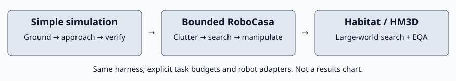

# Environments and acceptance progression

Our goal is **one agent harness across EQA, find/OVMM and multistep tasks**.
Environment choice separates failure causes; it is not permission to add a
benchmark-specific agent. Robot adapters may differ where physically necessary.

*Conceptual test order, not measured results or a universal ranking of datasets.*

| Environment | Primary question | What a pass does not establish |
| --- | --- | --- |
| [Simple MuJoCo scene](simple_sim.md) | Can the agent see, ground, approach and re-verify a known visible target? | Clutter robustness or long-range search |
| [RoboCasa](robocasa.md) | Can the same loop search a bounded workspace and complete manipulation amid clutter? | Whole-home coverage or arbitrary robot support |
| [Habitat / HM3D](habitat.md) | Can exploration find useful evidence across a large environment, for OVMM and EQA? | Physical grasping or real-robot navigation reliability |
| [MolmoSpaces](molmospaces.md) | Does the harness transfer to additional layouts, objects and robot assets? | Uniform difficulty or correct embodiment merely from a registry name |

This is the agreed acceptance progression: simple sim first, then bounded
RoboCasa tasks, then Habitat search stress tests. MolmoSpaces adds a separate
diversity check. Large Habitat failures should not obscure a working local
manipulation loop; easy local successes must not stand in for large-world tests.

## Shared protocol

Hold model, grounding policy, memory policy and success semantics fixed across
environments when testing transfer. Record robot adapters, sensor settings,
starting visibility/distance, motion mode, and explicit task budgets. Budgets
may differ by task but must be declared before testing, not extended until a
failure passes. Within a paired comparison, keep cases and budgets matched.

Distinguish these stages in results:

1. Search brings the target into an informative view.
2. Grounding selects pixels belonging to the requested object, not its support.
3. Navigation approaches safely and obtains fresh verification.
4. Manipulation completes, with independent physical-outcome evidence.
5. Multistep execution preserves state and completes the requested sequence.

EQA additionally needs evidence supporting the answer; an object mask alone is
not enough. Relational queries require both target identity and the relationship
used to select it. Neither a tool's `ok` nor process exit zero proves task success.
GT may score outcomes or run explicitly labeled oracle controls; it must not
leak into learned-agent inputs. Keep oracle TAMP controls separate from learned
multistep acceptance.

## Commands, evidence and figures

- [Testing index](../TESTING.md): commands and suite entry points.
- [Evaluation runbook](../evaluation.md): managed jobs and artifact exports.
- [Figure/evidence checklist](figures/README.md): what to save and publish.
- [Shared grounding pilot](../experiments/shared_grounding_pilot.md): current
  bounded comparison and known failures, not a full sweep or default promotion.
- [Documentation guide](../README.md): where other material lives.
