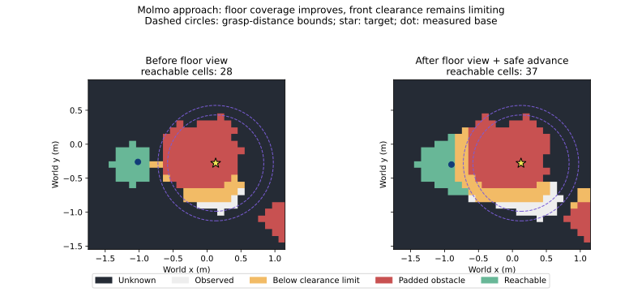
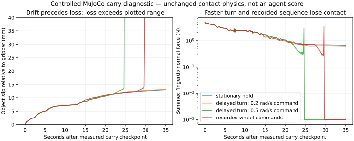
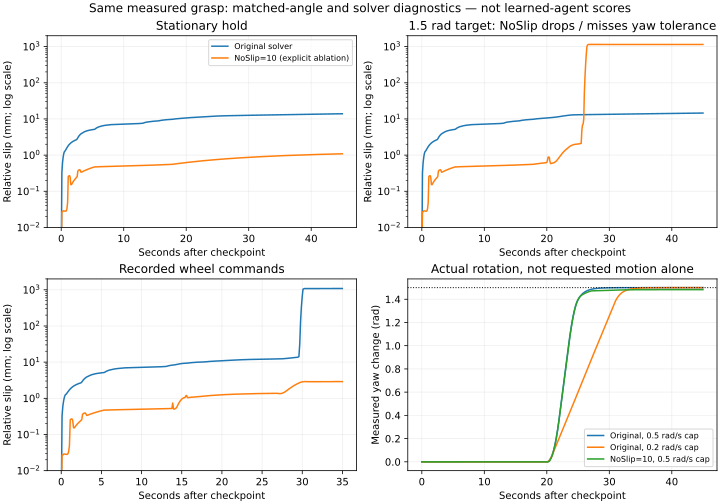
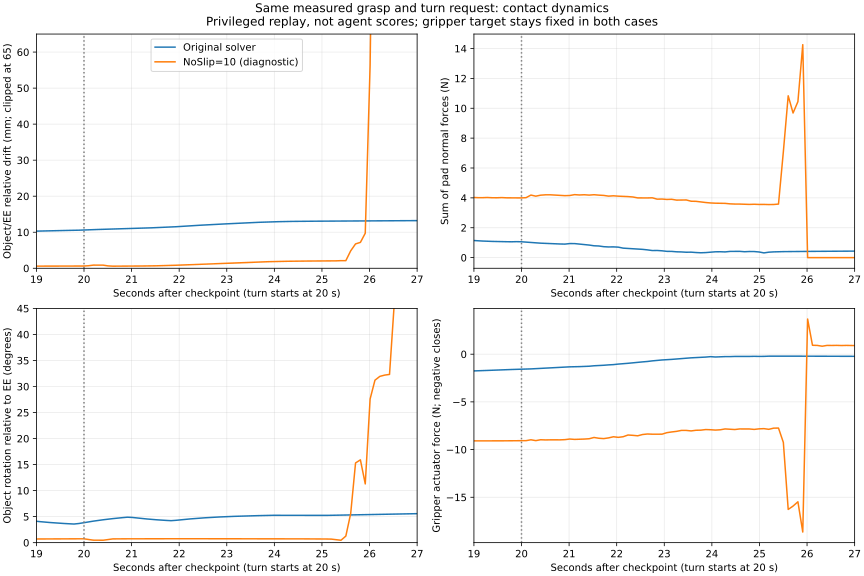
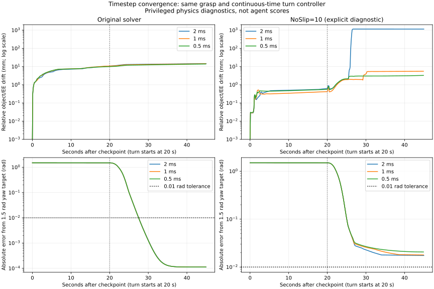
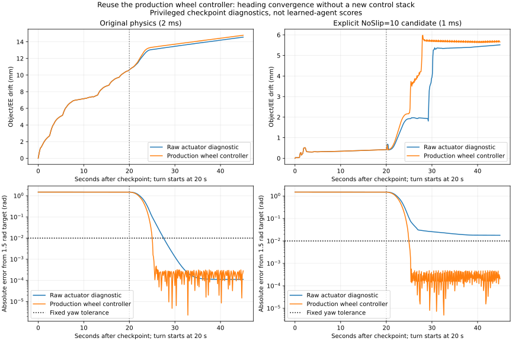

# Floor-coverage recovery pilot

## Current handoff: September 24

**The shared harness has useful repairs and reproducible diagnostics, but the
small-room end-to-end manipulation gates are not cleared.** Do not confuse
physics replay retention with learned pickup/carry/place success.

| Area | Latest supported status | Remaining gate |
| --- | --- | --- |
| Shared agent loop | Model-requested floor views and bounded retries work after isolating perception/chat conversations; malformed tool envelopes return actionable errors | Broader learned-task acceptance, without extra retries or weaker clearance |
| EQA | Last paired q12/q16 slice is 1/2 before/after with identical answers and steps; later diagnostic-only commits did not rerun EQA | Broader paired non-regression before merging the experimental stack |
| Molmo small-room OVMM | Lateral floor evidence enables a side route, but nearest target distance 0.976 m remains outside the 0.85 m grasp workspace | Audit padding/clearance/footprint interaction without bypassing safety |
| RoboCasa small-room OVMM | New explicit NoSlip10/1ms live trial lifts and retains the can through navigation; placement still rejects the relational destination. Earlier original-physics loose trials were inconsistent in carry | Relational destination grounding and broader retention validation; keep physics variants separate |
| Carry-loss guard | New live trial exercises two successful navigation-boundary possession checks, agreeing with the physical trace | Live loss/uncertainty behavior is still untested; positive checks do not validate drop detection |
| Physics diagnostics | Reusing the production wheel controller resolves the diagnostic heading shortfall. The 1 ms NoSlip candidate completes the turn and retains the can, with prior hold/route/release controls passing | Live learned validation; original physics still creeps and no default was changed |
| TAMP / Habitat OVMM | Not rerun in this carry-debugging batch | Later gates, after prioritized EQA and small-room OVMM |

Work is on `experiment/eqa-inspection-progress`, not main. This is a large
experimental stack (284 commits ahead of the **local** main reference when
checked at `8e66ad31`), not a single merge-ready patch. The remote main/PR status
was not refreshed by this diagnostic batch. Conversation isolation was already
split into main-based PR #176; keep other independently verified repairs scoped
for review rather than merge the entire stack on checkpoint evidence. No main
push or production physics change was made here. Current focused suite:
**429 passed** including the paired localization audit. Detailed source revisions,
jobs, results and figures follow.

### Placement-purpose repair (source `7a9a29cc`)

The object verifier explicitly rejected support furniture, while placement
asked it to ground a countertop. The configured isolated-support presentation
also omitted the stove needed to verify the destination relation. Placement
now passes an explicit `placement_surface` purpose through destination search,
arrival verification and final reacquisition. It reuses existing full-scene,
outlined-context and isolated-measured-pixel panels. Object verification remains
unchanged, as do workspace, clearance and release gates.

The prompt accepts requested support furniture, but requires visible anchors
and rejects wrong-side candidates. Unqualified left/right is explicitly relative
to the full reference image; an explicitly different frame must be visually
established. This convention does not solve arbitrary viewpoint-dependent
language or navigation to an unseen receptacle.

Offline inspection of the frozen simulator scene confirms a separate counter
right of the stove. The failed saved view instead shows the left counter, so
rejecting that view is appropriate. Simulator body identities/positions were
used only for this audit, never supplied to the agent.

Paired replay job `20260924_225538_94e7dd` compares `support_only` with
`placement_surface` on eight manually labeled cases from two saved views:
generic countertop, left-of-stove, wrong-side right-of-stove, and missing-anchor
right-of-refrigerator requests. Multiple patches of the same countertop are
allowed where appropriate. Labels are fixed before inference and withheld from
the model. Artifacts: `~/runs/emet/placement-context-offline-20260925/`.
This is a diagnostic set, not held-out acceptance: it contains no positive view
of the intended right-side counter.

Completed replay: **support-only 5/8, placement-context 7/8**. The new variant
accepts all four valid countertop requests and rejects both missing-refrigerator
requests. However, it still accepts the left counter for a right-of-stove query
in the earlier frame (`grounding-91d6c03bbf6d48009d38c7d798edbf7b`). In that same
frame it accepts the opposite, left-of-stove request too. Full scene inspection
confirms this is a model relation error, not a correct alternative target.
The old variant makes the same wrong-side error and additionally invents a
refrigerator anchor. No prompts were tuned after these results.

**Live placement rerun held:** the wrong-side negative gate is not cleared.
This small result supports fixing the contradictory task semantics, not claiming
reliable relational grounding or end-to-end placement. Next diagnose whether
query-independent relation description (using the existing context replay
machinery) removes request agreement, with both directions and missing-anchor
controls. Do not force acceptance, weaken clearance, or redefine the task.
Before promotion, add a positive view of the intended right counter and rerun
the frozen live task. The original physics versus NoSlip10/1ms distinction
remains in force.

### Query-independent relation replay (September 25)

Job `20260925_105133_e602b8`, source `7bf6666c`, completed on the same eight
cases, Qwen3-VL-8B int4 and fixed measured candidates. One query-blind visual
description per view was reused for all four requests; a second text-only call
selected from those descriptions. The direct placement-context control was
rerun in the same job. No runtime agent changes or live task were made.
Artifacts, full prompts/responses, candidate panels, input hashes, manifest and
the exact diagnostic driver are in
`~/runs/emet/placement-blind-relations-20260925/`.

| Variant | Correct selections/abstentions | Wrong-side negatives | Missing-anchor negatives |
| --- | --- | --- | --- |
| Direct placement context, rerun | 6/8 | 1/2 | 1/2 |
| Query-blind description then selection | 7/8 | 1/2 | 2/2 |

Both variants accept all four positive requests, but the nominal score hides
inconsistent reasoning. On the earlier frame, the blind description already
misstates the countertop as right of the stove and invents a paper towel from
its texture. The selector then accepts the left-of-stove request despite that
opposite recorded relation, and also accepts right-of-stove. Thus this is not
only target-conditioned visual agreement: the blind visual stage is wrong,
and the text selection stage does not consistently obey its evidence. A
nominally correct selection can have an unsupported rationale.

**Do not promote this two-stage variant.** It adds inference without clearing
the failed negative gate. Direct replay also changed from the earlier 7/8 to
6/8; these tiny diagnostic runs are not a robust accuracy estimate. Runtime
remains on the existing placement-purpose repair, with live acceptance still
blocked. Next isolate the visual relation on a single full-frame image and
test explicit candidate/anchor localization, rather than adding more semantic
verification stages. Include an actual positive right-counter view before
retesting live. No geometry, clearance or release threshold was relaxed.

### Frozen paired acceptance sequence (September 25)

The immediate comparison isolates perception, not the full agent. Run
`scripts/audit_placement_relations.py` with a frozen manifest and fresh output
directory through the serial CPU-safe GPU job runner. Source `161d95cc`, job
`20260925_112141_1c6125`, artifacts `~/runs/emet/placement-paired-20260925/`.

- Five full-image views: the two saved failures and three static, oracle-aimed
  RoboCasa camera views showing both sides of the stove. Three repeated calls
  per view/query, not three independent environments or episode seeds.
- Three requests per view: countertop left of stove, right of stove, and right
  of refrigerator. The refrigerator is absent in the old views and partially
  visible at the far right in some new views; no countertop is to its right.
- Control: direct full-image relational bounding box. Candidate: independently
  locate all countertop top surfaces, stove and refrigerator, then apply fixed
  image-coordinate center ordering with a 50/1000 margin. A missing/ambiguous
  anchor or multiple qualifying counters produces abstention. Neither variant
  receives evaluator labels or simulator IDs. This is not the previous
  multi-panel measured-surface verifier; scores cannot be pooled across them.
- Reference top-surface boxes manually frozen before inference. Positive box
  agreement requires IoU >= 0.3; negatives require abstention. Malformed outputs
  are failures, not successful abstentions. Save all boxes, prompts, responses,
  image hashes and overlays. These loose 2D annotations do not establish safe
  3D support or a successful placement.
- Promotion gate: no wrong-side/missing-anchor false acceptance in the repeated
  diagnostic, positive localization at least as good as the paired control,
  and manual overlay review. Do not adjust thresholds after seeing outcomes.
  Any failure keeps the candidate offline; investigate the earliest bad box or
  unsupported relation rather than add generic retries.

Capture preflight rejected one outside-wall camera attempt and one attempt
with rangefinder debug overlays. Both are retained under `inputs`/`inputs-v2`;
only inspected clean `inputs-v3` images enter inference. The capture helper now
disables rangefinder visualization. No physics, actuation or robot navigation
is performed in these free-camera captures.

After this gate, the bounded *agent* pairs should be staged as follows. Freeze
an implementation SHA before starting; never edit a running checkout. Use the
same local Qwen configuration, instructions, initial state, scene hashes,
budgets and evaluator for each pair, with fresh process/evidence directories.

| Stage | Control / candidate | Minimum bounded evidence | Response to failure |
| --- | --- | --- | --- |
| RoboCasa learned pick/carry/place | Pre-placement-purpose `1a597378` / accepted runtime repair SHA, if one is ready | Two matched repeats of the frozen visible-can case using the **same explicit NoSlip10/1ms derivative**; physical pick, retention, correct support, release, runtime and tool traces | Stop at first failed stage; do not count wrong-target placement or agent text as success |
| EQA non-regression | Same frozen code pair, identical config and question IDs | q12/q16 repeated twice per side, paired answers, observations, motion/coverage and forced-answer status | Investigate paired trace differences; tiny slice is a smoke gate, not a paper accuracy claim |
| Molmo small-room manipulation | Same frozen code pair and previously audited scene/config | Two matched repeats; physical success and workspace/clearance rejection reasons | Keep the known 0.976 m versus 0.85 m workspace issue visible; no threshold relaxation |

The staged NoSlip pair isolates policy effects within that declared diagnostic
physics. It does not clear original/default-physics robustness, broader EQA,
possession-loss negatives, TAMP or Habitat-OVMM. Those remain separately tracked.
No full sweep, real-robot run or main push is part of this batch.

#### Completed paired localization results

The job completed all 90 decisions (45 per approach), with no malformed
responses. Same Qwen3-VL-8B int4, full images, max 512 output tokens, reference
labels and scorer throughout. Results are repeated diagnostic decisions, **not
45 independent scenes** or end-to-end task success.

| Approach | Total | Positive localization | Negative abstention |
| --- | --- | --- | --- |
| Direct full-image relational box | 36/45 | 21/24 | 15/21 |
| Independent entity boxes + fixed center ordering | 33/45 | 12/24 | 21/21 |

Failure patterns repeated across all three calls:

- Direct grounding selects the wrong-side counter in the earlier saved view
  (3/3), and incorrectly selects a counter for right-of-refrigerator in the
  new oblique-left view (3/3). Both variants poorly localize the left countertop
  in the new oblique-right view (3/3 each).
- Independent localization merges both counters and the stove into one wide
  countertop box in the front and oblique-left views. This misses the front
  left target and both oblique-left targets (nine additional positive failures).
  A front right selection can still pass loose bbox IoU despite containing
  the stove; manual overlay review therefore fails even some nominal passes.
- The original saved-view wrong-side error disappears under coordinate
  ordering, but the new multi-instance localization errors offset that gain.
  This separates relation-reasoning failure from candidate-localization failure;
  it does not establish a safe general placement method.

**Neither approach clears promotion.** No runtime box-ordering policy or live
RoboCasa rerun was introduced. Preserve the fixed threshold and both scores.
Next bounded diagnostic: retain separately measured surface candidates and
localize the anchor independently, instead of asking Qwen to enumerate all
countertops in one box response. Compare on these exact inputs, with no added
retry budget, before any runtime integration. Identity validation and actual
depth/clearance checks are still required; 2D ordering alone is insufficient.

Visual audit files (under the artifact root's `results/`):
`0-front/localized.png`, `0-oblique_left/localized.png`,
`0-oblique_right/localized.png`, `0-saved_early/localized.png`.
Each case also retains prediction-versus-reference overlays, localization JSON,
raw prompts/responses, hashes and repeated outcomes in `results.json`. The
three new views positively cover the intended right countertop, unlike the
earlier eight-case replay.

### Measured-support follow-up (September 25)

Source `fb4560f8`, job `20260925_133331_072c5f`, same five views/three requests/
three repeats. Reuse the prior query-independent countertop search boxes and
anchor predictions exactly. Replace the broad countertop boxes with the
existing RGB-D connected surface proposals, then ask Qwen to identify pure
countertop supports without seeing the requested relation. Fixed coordinate
ordering, eight-candidate bound and original scoring thresholds remain unchanged.
No GT masks or detector labels enter inference.

The first temporary driver incorrectly passed NumPy scalar coordinates into
the strict JSON-box validator, creating spurious positive abstentions. The
corrected driver converts them to Python floats and replays the **same cached
semantic responses**, with no new model inference or threshold change. Original
artifacts remain in `~/runs/emet/placement-measured-paired-20260925/`; authoritative
rescoring, overlays, protocol and exact driver are in
`~/runs/emet/placement-measured-paired-rescore-20260925/`.

Corrected result: **35/45**, positives **17/24**, negatives **18/21**. All three
negative failures are pipeline overflows on the oblique-right view, not wrong-
side selections; they are deliberately not counted as successful abstentions.
The same overflow loses six positives. One further positive is an abstention
on the oblique-left right counter. Repeats score 11/15, 12/15, 12/15.

Manual review still fails: in the front view the RGB-D component joins stove
pixels to the right countertop, and Qwen accepts it. The isolated support panel
(`0-front/panel-3.png`) confirms actual mixed measured support, not merely a
wide enclosing box. Loose bbox agreement therefore overstates safe support
identification. The RGB-D proposal variant is not promoted.

A bounded SAM2 follow-up (`20260925_133732_8c3814`) uses the existing small
SAM2 model inside the exact same cached boxes, followed by the same connected-
depth splitting, semantic prompt, anchors and scorer. No YOLOE or GT masks are
used. Artifacts: `~/runs/emet/placement-sam2-paired-20260925/`. Its purpose is
to test mixed-support separation without increasing the candidate bound or
introducing a new runtime policy.

#### Final mask audit and verifier ablation (September 26)

SAM2 finishes **37/45**: positives **16/24**, negatives **21/21**, with six
positive abstentions and two low-overlap boxes. This is box agreement, not a
placement success rate. The final relation check can abstain even when the
preceding verifier accepts an unsafe candidate.

The completed mask audit finds exactly that problem. Compare every new-view
candidate with the separately saved simulator segmentation, after inference.
`~/runs/emet/placement-sam2-mask-audit-20260926/` contains the exact evaluator,
geometry-ID mapping, per-mask pixel counts and accepted-mask contact sheet.
Of 17 accepted candidates in the three new views/repeats, five contain less
than 95% counter-top geometry (a post-hoc descriptive cutoff, not a new runtime
threshold). Most importantly, `2-oblique_right` accepts a **wall-only** mask
and a **mostly-toaster** mask (3.7% countertop). Manual review agrees. Old
saved views have no GT segmentation; their six accepted masks were reviewed
visually only. Geometry membership does not establish upward-facing support,
clearance, reachability or safe release.

The frontal right-counter miss is **not SAM2 losing the counter**. Candidate 0
contains 100% counter-top geometry in all three frozen repeats, but Qwen omits
it. The earlier hypothesis of missing SAM2 geometry is therefore rejected.

Job `20260926_011026_4f12ab` tests the simplest presentation alternative:
batch versus one candidate per call, using identical saved panels, prompt,
geometry, Qwen3-VL-8B int4 configuration, anchors and scoring. Tool:
`scripts/audit_surface_verification.py`; artifacts:
`~/runs/emet/placement-verifier-smoke-20260926/`. Two development views (front,
oblique-right), three frozen proposal sets each, three relation queries yield
18 decisions per arm. Batch **12/18**, individual **13/18**. Individual
verification recovers the frontal positives but accepts additional wall,
sink/appliance and mixed candidates. Its explanations sometimes describe the
surrounding countertop instead of the measured mask. This supports contextual
misidentification, not a proven model/transport root cause. Per-call prompts,
raw responses, panel hashes and latency are saved. Neither variant is promoted.

The focused suite passes **436 tests**. No runtime defaults, thresholds or
physics were changed. SAM2 remains opt-in. The proposed overnight agent
comparison is therefore a **runtime health/attribution** run, not a trial of
an accepted new verifier: pre-placement-purpose `1a597378` versus the frozen
current branch. Pair q12/q16 at seeds 0/1 first; then two RoboCasa and two
Molmo repeats per arm; then the remaining ten established EQA development
questions at seed 0. Run serially with CPU-safe/GPU-exclusive scheduling.
RoboCasa retains the explicit NoSlip10/1ms derivative on both arms; Molmo
retains its existing physics/config and workspace limits. Save images, maps,
tool traces and physical scores. Stop on timeout/native crash/preflight
failure; ordinary task failures remain scored and do not abort unrelated
cases. No new unsafe verifier is wired in to make the run look better.

The EQA development extension is not a held-out paper result. Report paired
question/seed outcomes, forced-answer behavior, runtime and infrastructure
failures separately. A larger count on the same views/questions is not
evidence of environment generalization. Live placement remains unresolved
until the selected support and physical outcome are independently verified.

## Starting point

The September 23 small-room controls both stopped before grasping. Molmo had
28 reachable cells, all outside the 0.709–0.85 m grasp workspace. RoboCasa had
five candidates in range, all rejected by the explored-footprint check, not
by observed obstacle overlap. These are Stretch-in-MuJoCo controls, not RBY1.
Artifacts: `~/runs/emet/grasp-approach-audit-20260923/`.

## Contract

The tool result distinguishes `insufficient_floor_coverage`,
`workspace_obstructed`, and `no_reachable_workspace`. The last code does not
prove either missing coverage or a physical obstacle. Results include radial
bounds, reachable-cell counts, and rejection counts; no simulator truth enters
the agent. The planner retains its existing footprint and clearance checks.

For a confirmed pre-grasp rejection with no pickup executed and a successful
post-action observation, the model may request `observe_floor`. The failed
batch is discarded. Only that observation is executable in the next round;
another action requires a subsequent round after the observation succeeds.
The existing three-round budget is unchanged. Uncertain payloads, stale frames,
unconfirmed head motion, and failed mapping do not authorize a retry.

The observation moves only the head, requires measured head pose and a newer
received frame after motion, then updates the map from calibrated RGB-D.
Frame receipt sequence is not an acquisition timestamp guarantee; stronger
bridge timestamp validation remains useful. No clearance is inferred from a
successful observation. Adapters lacking the required capabilities refuse it.
Lidar may provide obstacle evidence, but free scan rays are not floor support
or proof against drop-offs.

## Acceptance

Run the frozen small-room Molmo and RoboCasa controls serially, with the same
Qwen preset, seeds, budgets and independent physical scorer. Inspect whether
the model requests the observation, whether the map gains usable coverage,
whether replanning succeeds, and whether physical pick/place passes. Do not
call the change an OVMM improvement solely because the head moved.

EQA uses its existing separate episode tool pack; this pilot changes CHAT
manipulation recovery, not EQA policy. The low-level diagnostics are shared.
No robot-specific policy branches or weakened safety thresholds are added.

## September 24 results

Three sequential managed jobs, unchanged task prompts and physical scorers:

- `20260924_083453_7df611`, source `4cb00bf0`, Molmo + RoboCasa:
  both physical pick/place false. Molmo exposed a contradictory system prompt
  forbidding all recovery; RoboCasa happened to obtain a grasp workspace without
  the new observation, then failed fresh manipulation target verification.
- `20260924_084308_7c9cad`, source `9fc4c927`, Molmo: Qwen selected
  `observe_floor`, which succeeded, but the next turn returned object labels.
  Chat and perception share a VLM client; caption inference had reset the agent
  conversation. The system prompt repair alone was therefore insufficient.
- `20260924_084920_24fb06`, source `213b239f`, Molmo: conversation isolation
  across tool execution enabled the complete model-directed sequence: failed
  pickup, floor observation, and pickup retry. Reachable cells increased 28→37;
  nearest reachable target distance improved 1.027→0.927 m, still outside the
  unchanged 0.85 m maximum. The retry stopped safely; physical pick/place false.

Artifacts respectively live under `~/runs/emet/floor-recovery-20260924/`,
`~/runs/emet/floor-recovery-prompt-20260924/`, and
`~/runs/emet/floor-recovery-context-20260924/`. Inspect `process.log`,
`physical_result.json`, and `evidence/navigation/failed_approach_*.npz` inside
each room's `hybrid_learned_pick_place` directory. Chat transcripts are also
under the frozen worktree's `logs/chat/`. All agent processes exited zero;
managed jobs failed on the independent physical scorer, not task success.

203 focused tests pass on the final code, including navigation, view quality,
tool contracts, grasp handoff, payload guards, and conversation restoration on
both successful and exceptional perception calls. No full EQA run was made.

Next investigate why one floor view leaves the remaining approach unobserved:
inspect actual depth/map support and footprint coverage before adding retries
or enlarging budgets. Do not increase grasp reach or weaken unknown-space checks.
This establishes usable model-directed recovery, not completed OVMM acceptance.

## Follow-up: coverage versus clearance

The follow-up **corrects the pure missing-floor hypothesis above**. Along the
straight approach, the next cell at (-0.8, -0.3) is already observed but has
0.156 m obstacle clearance, below the configured 0.22 m requirement. Sensor
depth places the counter edge near x=-0.43 m; the 0.1 m grid pads obstacles by
two cells before A* applies clearance. These safeguards combine to constrain
the approach. This is not sufficient evidence to weaken either safeguard.



The figure replays the saved `floor-second-observation-20260924` planner maps
(0.1 m cells, grid origin 512,512). It uses no simulator geometry. Red is the
**padded map**, not the physical counter outline. Eight observed, center-clear
cells fall within the grasp-distance annulus beside the counter, but are
disconnected from the reachable component. Full footprint/path validity at
those cells has not been established. A lateral observation/route is a useful
next hypothesis; straight-ahead observations cannot remove an observed obstacle.

### Controlled second observation

The default three-round budget was not increased. The pilot driver accepts an
optional recorded `SIM_FOLLOWUP_COMMAND` for a second user instruction. Such a
run is **assisted diagnostic evidence**, not an autonomous policy score.

- `20260924_101650_2846e7` (`a35da35e`): conditional follow-up was not executed;
  the model emitted malformed farewell JSON. Do not count it as a second view.
- `20260924_102207_03e568` (`a35da35e`): direct follow-up attempted
  `observe_floor` with a missing JSON brace. The parser salvaged its inner
  arguments dictionary and silently treated it as a completed turn.
- `d5398a75` repairs that failure: malformed tool envelopes return
  `invalid_tool_call_json`; no action is dispatched, and correction consumes an
  existing tool round. No string-based action repair or extra budget is added.
- `20260924_103619_b798fd` (`d5398a75`): the model corrected its malformed reply,
  executed the second floor observation and retried. Reachable cells stayed
  **37→37**, nearest reachable target distance stayed **0.927→0.927 m**, and the
  measured base stayed approximately **(-0.8982, -0.2989)**. Observed-cell count
  changed 230→222; global observed counts are not a navigation-success metric.
  Physical pick/place remained false, and execution stopped at the budget.

Each output directory is under `~/runs/emet/`, named after its job (without the
timestamp ID). Floor captures now retain RGB, depth, calibration, head/base pose,
and before/after maps in `evidence/navigation/floor_observation_*.{png,npz}`.
Failed approaches also retain the clearance field and required clearance.

### RoboCasa and EQA rechecks

`20260924_101836_068a73`, source `a35da35e`, uses the unchanged RoboCasa task
prompt. Five in-range footprint checks initially fail on unknown floor. Qwen
requests a floor view, adds 51 observed cells, retries and reaches manipulation.
Thus coverage recovery works in this episode, but **physical pick/place is
still false**. The independent trace records 37 gripper-contact samples and a
minimum gripper-center/can-center separation of 0.00215 m. The can shifts about
10 cm and topples rather than lifting; the gripper subsequently rises about
13 cm without it. This is a grasp-retention failure, not navigation timeout.

Manual inspection also finds a distinct verifier error: the post-lift crop
accepts the nearby metal paper-towel holder as `can`. Initial grounding tracked
the actual red can. The near-gripper check rejects the final result, correctly
preventing placement, but same-object identity needs to survive manipulation.
Exact image: `floor-followup-robocasa-20260924/robocasa/hybrid_learned_pick_place/`
`evidence/grasp_lift_verification/grounding-40195db7d3cf4c79b0d8a01292ecd3db.png`.

EQA job `20260924_101816_1a1131` compares `91871b77` with `a35da35e`, seed 0,
q12/q16: **both 1/2**, identical answers (q12 B/wrong, q16 C/right), 14 planning
steps each, all four processes exit zero. Final-source recheck
`20260924_103655_e82504` on `d5398a75` reproduces those answers and step counts.
This is a small paired non-regression signal, not a broad EQA acceptance claim.
All heavy jobs ran serially under the exclusive GPU lock with CPU-safe limits.

### Review and remaining gates

- Standalone conversation isolation is [PR #176](https://github.com/cpaxton/home_robot_v3/pull/176),
  branch `fix/shared-vlm-conversation`, commit `138ac920`, based on main. Only
  dialogue isolation and its tests are included: no experimental recovery,
  navigation, benchmark or threshold changes. 35 targeted tests and hooks pass;
  no remote CI checks were reported at the time of testing. Main is unchanged.
- The experiment candidate passes 207 focused tests. Evidence capture and
  malformed-response handling remain on `experiment/eqa-inspection-progress`.
- Do not increase straight-ahead recovery retries: the second view plateaued.
  Test floor coverage along a lateral approach, retaining full footprint/path
  checks; audit padding/clearance semantics before any safety-margin change.
- Diagnose RoboCasa grasp retention from the contact/closure/lift trace, and
  preserve target identity in post-action verification. Neither small-room
  physical manipulation gate has passed.

### Lateral observation and closure diagnosis (September 24 follow-up)

`17ce63f1` exposes optional absolute `pan_rad` on `observe_floor`, bounded to
[-1, 1] radians. Omitting it preserves measured pan. Invalid values stop before
motion; measured head pose, fresh-frame and map-update checks remain unchanged.
No base motion or clearance relaxation is added. 227 focused tests pass.

Molmo job `20260924_111809_f49e11` (`floor-lateral-molmo-20260924`) completed
in 327 seconds. An explicit diagnostic follow-up requested pan -0.8, then
another pick/place attempt; this is not an autonomous policy score. The floor
capture measured pan -0.7994 / tilt -0.9992 and added 65 observed cells. The
planner found a lateral route toward (-0.8, -0.6), with minimum clearance
0.2383 m against the unchanged 0.22 m requirement, and the robot moved.
However, final grasp sampling still failed: 38 reachable cells, nearest target
0.9763 m versus 0.85 m maximum. Independent physical pick/place is false/false.
Do not equate more observed cells or a new route with successful approach.

The prior RoboCasa trace identifies excessive closure as a concrete hypothesis:
before lift, both tips apply roughly 19 N with 5–7 mm simulated penetration;
the can moves ~2 cm while lift stays at ~0.8684 m. The lift command does **not**
overwrite the gripper target: full joints are converted to the six manipulation
joints. Do not attribute this failure to a reopening command.

A private sampled-control checkpoint diagnostic starts at sim time 73.01 s
from the saved qpos/qvel/act/ctrl/warm-start state in the unchanged frozen scene.
Linearly replayed controls reproduce failure (maximum rise 0.0103 m; final
object/gripper separation 0.1858 m). Clamping only gripper closure to the existing
`GRIPPER_CLOSED_LOOSE` preset gives 0.1263 m rise and 0.00635 m final separation.
This is approximate sampled replay with evaluator state, **not learned-agent
evidence**, and supplies no GT to the live agent. Diagnostic script:
`/tmp/replay_closure_20260924.py`; source trace is the RoboCasa run above.

`query_geometry_loose_pilot.yaml` selects that existing preset through
`mapping.grasp.loose`, inheriting all tracked/narrow settings. Explicit operation
arguments override config; absent config preserves the old false default.
Non-boolean values are rejected. This is a closure-only ablation, not force
control, a physics change, or a proposed hardware default. Full learned RoboCasa
validation and same-object post-lift identity remain required.

Full learned RoboCasa job `20260924_112629_939c18`
(`closure-loose-robocasa-20260924`, source `1f25ddae`) completed in 308 seconds:
**independent physical pickup true, placement false**. The original task prompt
and scene are unchanged; no assisted follow-up was supplied. Qwen selected floor
recovery, retried, and the log confirms closure to 0.0 rather than -0.3. Both
lift/carry visual checks passed. At the last private trace sample (124.826 s),
the actual can remained in gripper contact, 0.02179 m from its center, after
navigation to the placement area. This supports retention on one live episode;
it does not establish generality across objects or real robots.

Placement stops on `target absent or ambiguous`, not a dropped object. Saved
grounding records show inconsistent localization of `countertop_right_of_stove`:
one abstention cites a missing stove in the current coffee-machine view.
Inspect relational destination context and final support verification next;
do not bypass abstention or release onto an unverified surface. The separate
same-object verifier weakness exposed by the earlier failed pickup remains open.
Final focused suite: **240 passed**, two existing SWIG warnings. No new EQA
episode was run for these CHAT/grasp-only changes; prior EQA numbers above are
not a new acceptance result.

The final Molmo lateral map also shows observed neighboring cells failing
clearance (0.067–0.176 m). Audit map semantics before further scans: the
`pad_obstacles: 2` dilation operates on 2D grid cells (0.1 m in this pilot),
then AStar computes its 0.22 m clearance on that padded map; oriented footprint
validation also consumes the padded obstacles. The YAML comment's `voxel_size`
wording is misleading. This is evidence of overlapping conservative margins,
not permission to remove them without geometry/contact acceptance tests.

### Repeat and carry-loss detection

Frozen `b40bf9b3` repeat `20260924_120339_d33727` completes in 578 s:
physical pickup true, placement false. Unlike the first loose run, the actual
can is lost during base travel: last contact at sim 109.730 s, falling by
109.832 s and on the floor by 110.240 s. Destination search continues until
`target absent or ambiguous`. The final object/gripper separation is 1.679 m.
Thus loose closure has two pickup successes on the same fixture, but **does not
establish reliable retention** and has zero complete placements.

The same-source tight control `20260924_120343_f5b315` completes in 65 s and
fails fresh can grounding before any closure. It is an end-to-end failure, but
not an isolated control for closure efficacy. Do not pool it as another
observed tight-grasp ejection.

The repeat's actuator trace keeps the gripper target at 0.00410 simulated slide
meters throughout travel. Relative object displacement gradually grows from
about 4 mm to 23 mm before loss; contact forces fall substantially. Wrist/lift
references are unchanged across the sampled loss interval. This is not an
explicit reopening command. Do not claim a torque/friction fix from these data.

New checks reuse fresh semantic RGB-D, gripper proximity and relative-position
verification before navigation and after completed trajectory chunks, including
the direct placement-workspace route. The head looks at the end effector and
restores its prior measured pose; no arm/base motion or GT is used by the check.
Confirmed grounded pickup installs the visual reference; confirmed release
clears it. Failed verification latches uncertainty, aborts the placement batch
with `payload_unverified`, and preserves the potentially-held-object interlock.
Missing visibility is **not** reported as a confirmed drop. These are stationary
boundary checks, not continuous sensing and not a repair for unstable grasping.
264 focused tests pass; live detection acceptance remains pending.

### Controlled carry battery

The live detection pilot `20260924_143622_768dff` stopped at initial can
grounding (68 s, physical false/false). It did not reach grasp or exercise the
new carry checks. This is not evidence that drop detection works in an episode.

Use `scripts/diagnose_carry_checkpoint.py` to separate that upstream variability
from grasp physics. It restores the same sampled MuJoCo state and compares:
stationary hold, straight travel, in-place turn, sharper braking, and interpolated
recorded controls. Non-recorded cases keep all non-wheel controls fixed. Motion
ramps up over 2 s, cruises for 4 s, then brakes over 2 s (0.25 s for the braking
ablation); the remaining duration tests retention. Wheel actuator gearing is
included, and references exceeding actuator limits are rejected.

This is **privileged diagnostic evidence**, not a learned-agent score or exact
replay. It uses existing physical-trace checkpoints, does not attach/teleport
objects, and leaves contact physics unchanged. Defaults explicitly describe the
Stretch fixture (wheel radius 0.0508 m, separation 0.3153 m), not a universal
robot model. Supply appropriate geometry/actuator names for other fixtures.

Example (from repo root, single-threaded CPU; run cases serially):

```bash
OMP_NUM_THREADS=1 OPENBLAS_NUM_THREADS=1 MKL_NUM_THREADS=1 \
  .venv/bin/python scripts/diagnose_carry_checkpoint.py \
  --scene /path/to/frozen/scene.xml --trace /path/to/physical_trace.jsonl \
  --time 80 --duration 35 --out /tmp/carry-diagnostic-new
```

Output includes input/script hashes, checkpoint, per-case sampled JSONL and a
summary. Loss means object/gripper distance exceeds 0.12 m for at least 0.2 s;
this is a diagnostic criterion, not the benchmark scorer. Inspect forces and
relative displacement as well as the binary event. A no-loss 35 s result is not
proof of indefinitely stable retention. Profile tests: 12 passed; a 0.3 s real
MuJoCo hold smoke retained contact. Full battery pending.

#### Completed checkpoint results (September 24)

All conditions below use the same 80.048 s checkpoint from the loose-closure
repeat, 35 s evaluation duration, and unchanged contact physics. Jobs run
serially, single-threaded with CPU-safe affinity:

| Job | Conditions | Outcome |
| --- | --- | --- |
| `20260924_163132_b815bb` | hold; early straight/turn/brake at 0.05 m/s, 0.2 rad/s; full recorded replay | First four retain contact with 13.06–13.12 mm relative drift. Recorded replay loses the object at +29.48 s. |
| `20260924_163816_418c8a` | wheel-only recorded replay; same synthetic motions after 20 s hold | Wheel-only replay loses at +29.79 s. Delayed synthetic cases retain contact with 13.06–13.23 mm drift. |
| `20260924_164059_c5f7a3` | delayed straight/turn/brake at existing native speed limits, 0.09 m/s and 0.5 rad/s | Turn loses at +24.89 s. Straight and brake retain contact with ~13.06 mm drift. |

Artifacts are in `~/runs/emet/carry-checkpoint-{battery,aged,native-speed}-20260924/`.
The runner now accepts `--motion-delay` and `--modes recorded_wheels` to separate
grip aging and wheel motion from arm/head command changes. Recorded profiles
ignore the synthetic delay. Unit/regression suite: **277 passed**.



Actual motion was checked: the early straight profile travels 0.228 m, turn
rotates 0.773 rad, and braking profile travels 0.197 m; the stationary base
drifts only 0.00033 m. These are not failed-motion "retention successes".
Numbers in the table are commanded speed limits, not measured speed claims.
The faster synthetic turn also covers a larger angle because profile duration
is fixed. **Rate and total turn angle are confounded**; use an equal-angle route
comparison before claiming a rate-only repair or promoting a carry speed limit.

Private model reconstruction further finds the actual can center initially
~1.3–1.4 mm from pad center along pad-local X, drifting to ~24–25 mm before the
original drop; pad half-width is 20 mm. No non-finger object contacts occur in
the source trace from 95 s until contact loss. The gripper command remains
unchanged. This supports outward slip followed by motion-sensitive loss, not
an initially obvious shallow grasp, reopening command, or object/environment
collision. It does not establish a purely numerical cause or hardware safety.

Do not blindly deepen the grasp: the current preset already inherits 25 mm
contact-depth calibration, and the initial pad alignment is near-centered.
Next isolate equal-angle turn profiles and, separately, a clearly labeled
solver-only control for contact creep. Older mirrored/tabletop experiments
already investigated NoSlip and depth corrections; see
[earlier carry diagnostics](shared_grounding_pilot.md). Any physics comparison
must remain explicit and apply consistently across benchmark rows. No new
production speed, squeeze, contact, or safety-margin defaults were changed by
this battery. These are privileged diagnostics, **not agent acceptance**.

#### Predeclared matched-angle / solver-control follow-up

The next eight conditions use the same checkpoint without changing the grasp:
native hold (45 s); measured 1.5-rad turns at command caps 0.5 and 0.2 rad/s
(20 s initial hold, 45 s total); native recorded-wheel replay (35 s); then
NoSlip=10 hold, fast matched turn, recorded-wheel replay, and an 8 s release
negative. The latter ramps the gripper actuator to the explicitly supplied
0.04 open target between seconds 2 and 3. It does not remove an attachment.

The matched turns share feedback and acceleration limit (0.25 rad/s²), command
actual wheel motion, and record measured yaw/target completion. Neither case
counts as matched unless final yaw is within 0.01 rad of the requested angle.
This compares complete rate-limited turn profiles, not constant traversal time.
The solver-only override is explicit in arguments and manifest, along with the
model's original value. It is not a production environment change. If it reduces
creep, that supports a numerical contribution; it does not validate real-world
grasping. Keep the original-physics results and release negative alongside it.

Runner options: `--turn-angle 1.5`, `--noslip-iterations 10`, and
`--modes release --open-control 0.04`. Omitting the solver flag keeps original
physics; omitting turn angle retains the earlier open-loop profiles. Command
profile/validation tests: 22 pass. A real MuJoCo 0.3 s NoSlip smoke retained
contact; the full eight-condition battery is pending.

#### Completed matched-angle and solver results

Job `20260924_180149_7c03aa`, frozen source `dfe3a66b`, completed all eight
conditions serially. Artifacts: `~/runs/emet/carry-matched-solver-20260924/`.
Original solver manifests record NoSlip=0; explicit solver-control manifests
record original 0 / effective 10. No scene files or production defaults changed.

| Condition | Retention / loss time after checkpoint | Relative drift / measured yaw |
| --- | --- | --- |
| Original hold, 45 s | Retained | Max drift 13.92 mm |
| Original matched turn, 0.5 rad/s cap | Retained | Max drift 14.56 mm; yaw 1.49989 rad, target reached |
| Original matched turn, 0.2 rad/s cap | Retained | Max drift 14.26 mm; yaw 1.49989 rad, target reached |
| Original recorded wheels, 35 s | Lost at 29.786 s | Contact lost; final separation 1.091 m |
| NoSlip=10 hold, 45 s | Retained | Max drift 1.09 mm |
| NoSlip=10 matched-turn request, 0.5 rad/s cap | **Lost at 26.114 s** | Yaw 1.48258 rad; **target tolerance failed** |
| NoSlip=10 recorded wheels, 35 s | Retained | Max drift 2.91 mm; final separation 9.62 mm |
| NoSlip=10 release negative, 8 s | Lost at 2.348 s after commanded opening begins at 2 s | No final gripper contact |



Interpretation:

- The original-physics matched turns both complete and retain the object. The
  earlier faster/larger open-loop turn failure does **not** establish that a
  0.5 rad/s cap alone is unsafe or that a lower cap fixes the harness. Braking,
  trajectory shape and accumulated grasp drift remain relevant.
- Changing only the solver option strongly reduces stationary creep and
  prevents the recorded-wheel drop. This supports a numerical contribution,
  not a universal solver fix: its turning counterexample must remain visible.
- The NoSlip turn is not a successful matched-angle comparison: it drops the
  object and misses the 0.01 rad yaw criterion by ending 0.01742 rad short.
  Sampled peak yaw rates are similar for the two fast cases (~0.42 rad/s).
  Base roll stays below 0.004° and pitch below 0.193° in all three turn cases;
  there is no evidence here that the robot falls over.
- The opening negative confirms release is still possible. It does not prove
  general physical realism. All results are privileged diagnostics from one
  measured grasp, not learned-agent scores or real-robot acceptance.

Decision: retain production settings and both failure controls. Next inspect
object/pad contact dynamics during the NoSlip turning counterexample before
choosing a scoped physics or carry-controller change. Do not deepen an already
near-centered grasp or promote a speed cap based on these results. The live
carry-visibility guard still needs an episode that reaches manipulation; these
offline controls do not validate its VLM behavior. Final focused suite:
**286 passed**, two existing SWIG warnings. EQA was not rerun for diagnostic-only
changes.

#### Contact-level follow-up: creep and abrupt rotation are different failures

Job `20260924_194422_d82001`, source `2dd5ef71`, replayed the original and
NoSlip=10 fast turns **serially**, adding only read-only contact/actuator logging.
Both complete summary dictionaries exactly reproduce the earlier runs, including
NoSlip loss at 26.114 s and original retention. Artifacts:
`~/runs/emet/carry-contact-turns-20260924/{native,noslip}/`.
Each directory contains input hashes, the checkpoint, manifest, detailed
`turn.jsonl`, and summary. Reproduce using the preceding fast-turn arguments
plus `--contact-details`; retain the default 0.1 s sampling for exact comparison.
`--sample-period` optionally changes diagnostic sampling, not physics stepping.



Measured findings (times are relative to the checkpoint):

- **Original physics: gradual creep with unloading.** At 19.994 s the can has
  drifted 10.62 mm; pad normal forces are ~0.53 N each, down from ~2.4 N
  initially. At 25.502 s drift is 13.10 mm and each pad carries ~0.20 N.
  The can center moves from ~-1.3 mm to ~-18.1 mm along pad-local X, toward
  the edge of a pad with 20 mm half-width. It remains held for this turn, but
  retention alone hides a marginal contact state. Actuator closing force
  magnitude falls from 9.27 N initially to ~0.21 N at 25.502 s.
- **NoSlip: initially centered, then abrupt rotation/contact-force growth.**
  At 25.400 s drift is only 2.11 mm; relative rotation from the checkpoint is
  0.46 degrees and pad normal forces are 1.74/1.85 N. By 25.706 s rotation is
  15.31 degrees; forces have risen to 3.89/5.79 N. At 25.910 s normal forces
  reach 6.08/8.18 N and actuator closing force magnitude is 18.64 N. At
  26.012 s there are no sampled gripper contacts and separation is growing.
  This is not the gradual loss of squeezing force observed in the native run.
- **No commanded opening.** The gripper target stays fixed at ~0.00410 in
  both traces. Its position actuator has gain 4000 and velocity coefficient
  124; measured actuator force is not a fixed grip-force command. Do not
  conflate actuator force with the separately recorded pad normal forces.
- **No sampled external collision before ejection.** The NoSlip trace's first
  external object contact is at 26.522 s, after loss; the native trace has none.
  The ~0.102 s sampling can miss brief contacts, so this is not proof that no
  inter-sample impulse occurred. Earlier base-pose checks also found no tipping.

Interpretation: the NoSlip counterexample is consistent with a contact/solver
instability, rather than a shallow initial grasp or deliberate release. This is
still a hypothesis: rotation and force growth are observed together, not a
causal isolation of the numerical mechanism. MuJoCo's
[modeling guidance](https://mujoco.readthedocs.io/en/latest/modeling.html#preventing-slip)
also warns that NoSlip can destabilize complex multi-contact systems. The actual
fixture uses MuJoCo 3.5.0, Newton, elliptic cones, `impratio=20`, implicit-fast
integration and a 2 ms timestep; it is **already** using elevated friction
impedance, so “switch to elliptic/increase impratio” is not a new baseline fix.
The pads have six-dimensional contacts; neither friction coefficients nor pad
geometry were changed by this diagnostic.

Next bounded diagnostic: timestep convergence at 2/1/0.5 ms on this same turn,
with the same continuous-time controller and grip command, keeping original
and NoSlip physics separately labeled. If the abrupt event moves/disappears,
investigate numerical/contact stability before considering a grip-depth or
speed change. A retained turn alone is insufficient: any candidate must also
pass stationary hold, recorded-wheel replay and commanded-release negative,
then live learned pickup/carry/place. No runtime defaults changed; no new
learned-agent or EQA scores are claimed. **289 focused tests pass**, including
a real minimal MuJoCo contact-reading test that checks state is not mutated.

#### Timestep comparison: retention improves, combined gate still fails

Job `20260924_213259_ab5286`, source `8e66ad31`, completed six serial 45 s
turns. Artifacts: `~/runs/emet/carry-timestep-20260924/`. The runner now accepts
an explicit `--timestep` and records the original/effective value; omission
preserves scene physics. All runs restore the same 80.048 s checkpoint, keep
the gripper command fixed, delay motion 20 s, and request 1.5 rad with a
0.5 rad/s cap. The controller definition and acceleration limit stay fixed;
it is evaluated at each integration step. Wheel reference sequences therefore
respond to measured state, rather than being forced identical across runs.
This is an integration/controller-discretization check, not proof of a specific
internal solver bug. No geometry, mass, friction or success tolerance changed.

| Solver | Timestep | Retention at 45 s | Max relative drift | Final yaw / 0.01 rad gate |
| --- | --- | --- | --- | --- |
| Original | 2 ms | Retained | 14.56 mm | 1.49989 / pass |
| Original | 1 ms | Retained | 14.32 mm | 1.49989 / pass |
| Original | 0.5 ms | Retained | 13.83 mm | 1.49989 / pass |
| NoSlip=10 | 2 ms | Lost at 26.114 s | 1149.89 mm (includes fall) | 1.48258 / fail |
| NoSlip=10 | 1 ms | Retained | 5.52 mm | 1.48209 / fail |
| NoSlip=10 | 0.5 ms | Retained | 3.26 mm | 1.47937 / fail |



The native creep persists as the timestep shrinks. Conversely, the abrupt
NoSlip drop disappears at both smaller steps on this one checkpoint. That
supports numerical sensitivity but does not establish convergence or a robust
cross-object repair. The smaller-step NoSlip cases still under-turn by
0.01791/0.02063 rad: this is a failure of the diagnostic's matched-angle gate,
not by itself evidence that production navigation fails. At 1 ms, yaw advances
only 0.00258 rad over the last ~10 s while nonzero wheel references remain.
Low-speed tracking and the diagnostic controller need separate investigation;
do not silently relax the tolerance or claim these are successful matched turns.

Follow-up job `20260924_214214_77e9a3` tests NoSlip=10 / 1 ms stationary hold
(45 s), recorded wheels (35 s), and commanded release (8 s), serially after
all six turns. The 1 ms setting is selected for these **retention diagnostics**
because it is the cheapest smaller step that avoided the drop, not because it
passed the combined gate. Its known yaw failure remains visible regardless of
the follow-up results. No default promotion or new learned-agent score is
authorized by these controls alone. Focused tests: **293 passed**, two existing
SWIG warnings.

The follow-up completed all three controls at the same frozen source:

| NoSlip=10, 1 ms control | Outcome | Evidence |
| --- | --- | --- |
| Stationary hold, 45 s | Retained | Max relative drift 1.06 mm, final contact true |
| Recorded wheel sequence, 35 s | Retained | Max relative drift 2.80 mm, final contact true |
| Open-gripper negative, 8 s | Released as expected | Opening begins at 2 s; loss event at 2.301 s, no final contact |

Artifacts: `~/runs/emet/carry-timestep-controls-20260924/`. Both managed jobs
finished successfully; all nine conditions are recorded, not selectively
reported. Release is an expected negative, not a task failure. These results
support a **retention candidate** at 1 ms, not a complete matched-turn or
learned-agent acceptance result. There is no reason to declare the original
creep repaired, and the 0.5 ms condition has not received separate hold/route/
release checks. Retain those distinctions when comparing simulation settings.

Decision: no production physics changes and no new live agent battery on the
basis of a failed matched-angle gate. Next isolate the diagnostic's low-speed
wheel tracking while keeping the same angle tolerance, acceleration and safety
limits. A validated candidate then goes through live RoboCasa pickup/carry/
placement (including possession-loss behavior), small-room Molmo, and a paired
EQA regression check. That sequence remains open; this batch does not establish
long-horizon manipulation capability or justify merging the experimental stack.

#### Production wheel path resolves the diagnostic heading shortfall

The preceding failed yaw gate was **not a production control-stack failure**.
The diagnostic wrote transmission targets directly, bypassing the simulator's
existing `BaseController._set_base_velocity` path. That path already supplies
modeled joint-friction compensation, curvature-preserving saturation, and
wheel-reference acceleration limits. Near the stalled endpoint the raw targets
were ~+/-0.25; this fixture's compensation is ~+/-0.5833 (gear 3, gain 20,
joint frictionloss 35). No new minimum-speed trick, integral controller, or
looser tolerance was necessary to resolve this test mismatch.

Source `f55d4238` adds explicit `--wheel-controller production` for synthetic
profiles, calling the real controller without copying its logic. Previous
references are preserved before each controller call, so the acceleration ramp
is not bypassed. Historical `raw` remains the default for reproducibility.
Recorded actuator traces cannot use the production flag: compensating recorded
actuator outputs again would change the replay. Geometry/names must match the
production controller's configuration. The outer measured-yaw controller is
still the diagnostic controller, not a complete navigation-stack benchmark.

Job `20260924_221451_5e521b`, artifacts
`~/runs/emet/carry-production-wheels-20260924/`, ran both cases serially:

| Production wheel path | Final yaw | Peak overshoot | Max object/EE drift | Retention |
| --- | --- | --- | --- | --- |
| Original physics / 2 ms | 1.500192 rad | 0.001274 rad (0.073 degrees) | 14.79 mm | Retained |
| Explicit NoSlip=10 / 1 ms | 1.500462 rad | 0.000704 rad (0.040 degrees) | 5.98 mm | Retained |

Both clear the original 0.01 rad endpoint tolerance and a 0.01 rad overshoot
check. Compare each against its own raw-path control above, not against the
other physics setting: NoSlip / 1 ms changes from 1.48209 to 1.50046 rad while
remaining held. The native creep remains; a base-motion repair is not a grip
repair. Small residual feedback oscillations are visible in the plot, well
inside the angle tolerance on this checkpoint. Broader load/direction/task
acceptance is still open.



Focused suite: **335 passed**, including 71 diagnostic/wheel-controller tests.
No production controller behavior or physics defaults changed. The next live
RoboCasa pilot is `20260924_221944_72874e`, source `f55d4238`, using an explicit
derived scene with NoSlip=10 / 1 ms, the existing loose-grip config, Qwen3-VL-8B
int4, unchanged task prompt and independent physical scorer. The original scene
is untouched; model-load checks confirm matching masses, geometry, initial
qpos, actuator gains and dimensions. The live trial is gated on the completed
turn's retention, heading and overshoot checks. Keep this physics variant
separate from original-physics learned results.

#### Live candidate: verified pickup and retained carry, placement still blocked

Job `20260924_221944_72874e` finished in 443 s, agent exit code 0. The
independent scorer reports **pickup true / placement false**, verified trace;
the managed job correctly fails the task-success gate. It did not time out.
Artifacts: `~/runs/emet/carry-production-live-20260924/robocasa/`, including
the derived-scene XML and hashes, config snapshots, physical result, trace,
and RGB/grounding records. Comparing all loaded `model.opt` attributes confirms
only `timestep` and `noslip_iterations` differ from the original scene.

- Pickup is physically scored at sim 45.746 s. From sim 46 s to the final
  80.427 s sample, **343/343 recorded samples have gripper contact**; maximum
  object/EE separation is 10.78 mm and final separation is 3.72 mm. No sampled
  carry loss occurs. This is one learned trial on one object, not a general
  success rate or proof of continuous contact between samples.
- Two `navigation_payload_verification` records accept the actual red Coke
  can before/after the route. Manual inspection of the saved RGB agrees with
  the trace. The positive guard path is now exercised live; no induced-loss
  trial was performed, so the negative path remains open.
- Final placement returns `target absent or ambiguous` for
  `countertop_right_of_stove`. No release is commanded onto an unverified
  support. The task remains an end-to-end failure despite the carry progress.
- In final evidence `grounding-2e63c17500ad405c9452576f470f3cce`, the full RGB
  shows a countertop on the **image-left** side of the stove; the candidate
  sheet isolates small surfaces on black and omits the relational context.
  The VLM rejects the candidates for lacking stove/countertop context. This is
  not enough to claim the rejection is wrong: image-relative, scene-relative,
  and task-relative "right" must be disambiguated before selecting a support.
  An earlier candidate was accepted and subsequently rejected in a fresh view.
- Startup logs contain one gripper-open timeout; shutdown logs contain manager
  broken-pipe/reset errors after the task result. Neither is the recorded task
  failure, but this run is not evidence that simulator lifecycle/timing is clean.

Next scoped task: give relational support grounding the full contextual view
and an explicit reference-frame contract, while verifying the proposed local
placement surface from measured geometry. Do not simply loosen acceptance or
rename the target to whichever countertop is visible. Reuse saved views for a
small offline check, then rerun the same learned task with physics/model/budgets
frozen. Retain original-physics carry failures and the unresolved Molmo workspace
gate. No new EQA, Molmo or TAMP episode was run for this diagnostic-only code
change; the historical scores above are not fresh acceptance results.
