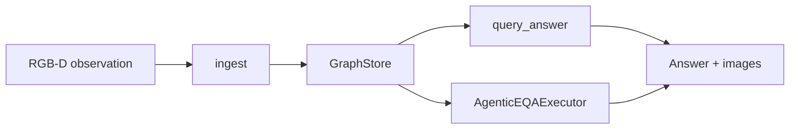

# Graph memory (`emet.memory.graph_eqa`)

Canonical map of the **graph memory** package. How-to CLI (`emet run graph-eqa`) stays in [graph_eqa.md](graph_eqa.md). Product default (merge/staleness) stays in [dynagraph.md](dynagraph.md).

The Python package is still named **`graph_eqa`**. That is a code path, not a second memory system.

## Glossary

| Name | What it is |
|------|------------|
| **Graph memory** | Object-centric scene graph used for EQA. Code: `emet.memory.graph_eqa`, class `GraphEQAMemory`. |
| **`graph_eqa`** | Python package path and CLI `emet run graph-eqa`. **Not** a second memory system. |
| **GraphEQA** | Paper (Saxena et al., [arXiv:2412.14480](https://arxiv.org/abs/2412.14480)) this re-implements. Product docs still say GraphEQA. |
| **`static_graph`** | Eval/paper backend id: same graph memory, merge/staleness **off**. Legacy alias `graph_eqa`. |
| **Dynagraph** | Same `GraphEQAMemory` + voxel nav + optional merge/staleness. Default `emet run agent`. |
| **LazyGraph** | Dynagraph that commits Qwen labels on arrival only. See [lazy_graph.md](lazy_graph.md). |
| **`mapping.scene_graph.SceneGraph`** | Legacy instance pairwise `near`/`on` — **not** this graph. |
| **`OpenVocabSceneGraph`** | Separate SigLIP instance graph (`open_vocab` backend). |
| **CHAT vs EQA_EPISODE** | Two orchestrators; graph memory is shared. See [AGENT_RUN.md](AGENT_RUN.md). |

## Data flow

Live detections become nodes/observations on a **`GraphStore`**. Two EQA loops read that store and must not be merged:

1. **Classic** — `GraphEQAController.run_eqa` → `GraphEQAMemory.query_answer` (prompt + selected RGB).
2. **Agentic** — Habitat / dynagraph when `eqa.agentic_verify` → `AgenticEQAExecutor` tools (`investigate`, `verify_siglip`, `submit_answer` / `finish`). Tool **names** are stable for traces.

## Package layout

`src/emet/memory/graph_eqa/` keeps this path. Facades stay small (≤250 lines) so the agent host can load them. Behavior lives in subpackages and is bound onto the facade. Old module paths (`graph_mutate`, `agentic_init`, …) are compatibility shims.

Product callers import from the package::

    from emet.memory.graph_eqa import GraphEQAMemory, AgenticEQAExecutor, run_agentic_eqa

| Subpackage / module | Job |
|---------------------|-----|
| `graph_memory.py` | `GraphEQAMemory` facade: owns `GraphStore` + `WorldEvidenceStore`; delegates `add_observation` / `query_answer` / `hypothesize_nav_targets`. |
| `store.py` | `GraphStore`: nodes, observations, edges, beliefs, frontiers, attempt ledger. Facade attributes (`_nodes`, …) are property aliases. |
| `types.py` | `GraphNode`, `GraphObservation`, `NavHypothesis`, `RelationBelief`, `VerifyResult`. |
| `geom.py` / `labels.py` / `count_mcq.py` | Shared planar geometry, question keywords, count-MCQ. |
| `ingest/` | Live RGB-D → graph (`graph_mutate`, `graph_observation_pipeline`, `instance_items`, `dynamem_graph_hooks`, `sensor_graph_builder`, `lazy_graph_commit`). |
| `spatial/` | Rooms, frontiers, RAG, place approaches (`room_clusters`, `room_clustering`, `room_labels`, `frontiers.py` barrel, `spatial_rag`, `place_approaches`, `graph_rooms`). |
| `fusion/` | Alias of `graph_object_fusion/` (XY / 3D IoU / embedding merge). Wire-up: `attach.py` (old `setup.py` is a shim). |
| `eqa/` | Classic `query_answer`, prompts, views, hypotheses, nav waypoints. |
| `agentic/` | `AgenticSession`, `EvidencePhase` (alias `AgenticState`), tool table (`executor_init.TOOL_HANDLERS`). Facade: `agentic_eqa.py`. |
| `eval/` | GT graph, question bank, dynagraph eval, calibration export, attempt metrics. |

Compatibility: `from emet.memory.graph_eqa.graph_memory import GraphEQAMemory` still works. `graph_types.py` re-exports `types` / `labels` / `geom` / `count_mcq`. Flat names such as `emet.memory.graph_eqa.graph_mutate` still import.

### Main types

| Type | Role |
|------|------|
| `GraphNode` | Object / viewpoint / frontier with labels, xyz, obs_id. |
| `GraphObservation` | Stored RGB + pose used as an evidence card. |
| `NavHypothesis` | Retrieved investigate card (graph / confirmed / SigLIP / frontier). |
| `GraphStore` | Owned mutable graph state. |
| `WorldEvidenceStore` | Voxel/confirmed/SigLIP channels beside the instance graph. |
| `AttemptRecord` | Opt-in action-outcome ledger row. |
| `AgenticSession` | Per-episode executor fields (`_tried`, hypotheses, traces). |
| `EvidencePhase` | FSM phase (`SEARCH` … `ANSWER`). `AgenticState` is the same enum. |

## Two EQA loops (do not merge)

| Loop | Entry | Stop |
|------|-------|------|
| Classic | `emet run graph-eqa` / Discord without `eqa.agentic_verify` | `query_answer` returns text + images |
| Agentic episode | Habitat / dynagraph when `eqa.agentic_verify` | Verify-gated `submit_answer` or explore `finish` |

CHAT Discord (`emet run agent`) uses a **different** skill pack. Do not rename EQA tools (`investigate`, `navigate_to_obs`, `verify_siglip`, `submit_answer`). Details: [AGENT_RUN.md](AGENT_RUN.md#skill-library-vs-orchestrator-modes).

## Where to edit

Loading a 7k-line module crashes the Cursor agent host. Edit the subpackage module that owns the method:

- Ingest / merge: `ingest/graph_mutate.py`, `ingest/graph_observation_pipeline.py`, `graph_init.py` (constructor; stays at package root)
- Rooms / frontiers: `spatial/graph_rooms.py`, `spatial/room_clusters.py`, `spatial/frontier_nodes.py`
- Classic EQA: `eqa/graph_answer.py`, `eqa/graph_prompt.py`, `eqa/graph_hypotheses.py`
- Agentic tools: `agentic/{executor_init,run,router,answer,verify,assess,capture,investigate,place,explore,action}.py`

`handle_tool` is a `dict` of handlers in `agentic.executor_init.TOOL_HANDLERS`.

## Voxel-nav stack (DynaMem / Dynagraph / LazyGraph)

Same robot loop, different memory policy. `DynamemController` is the voxel-nav parent; GraphEQA / Dynagraph / LazyGraph subclass it.

| Piece | Role |
|-------|------|
| `emet.controller.dynamem` | `DynamemController` facade. Perception, describe, look, nav, EQA live in sibling modules and are bound onto the class. Import path `controller_dynamem` is a shim. |
| `emet.utils.bind_methods` | Shared `bind_module_methods` (also used by graph memory). |
| `mapping/voxel/voxel_dynamem.py` | DynaMem `SparseVoxelMap` core (RGB-D ingest, occupancy, pickle). |
| `mapping/voxel/dynamem_localize.py` | Mixin: `localize_text`, SigLIP alignment, MLLM grounding. |
| `mapping/voxel/dynamem_eqa.py` | Mixin: classic voxel `query_answer` / frontiers. |
| `emet.app.graph_nav_cli` | Shared Click CLI for **Dynagraph** and **LazyGraph** (`configure_graph_nav`). |
| `emet.app.graph_nav_gt` | Ground-truth ready + Rerun help (used by the CLI and `zmq_mapping_session`). |

Do not merge CHAT vs EQA_EPISODE skill packs. EQA tool names stay stable.
