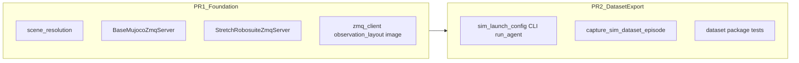

# Plan: `feature/dataset-sim-voxel-gt` — diff summary, two-PR split, merge order

Branch intent: **default-table merged MuJoCo ZMQ sim** (Stretch + generic robots), **stable RGB/depth/GT + client pinhole contract**, **YAML-driven sim launch**, optional **kinematic** stepping for collection, and **sim voxel + MuJoCo GT episode export** (`sim_voxel_gt_episode`).

---

## 1. Diff summary vs `origin/main`

### Working tree (uncommitted sim + dataset work)

The current **uncommitted** changes on this branch are focused on:

- **Simulation stack**: [`src/emet/simulation/base_mujoco_zmq_server.py`](../../src/emet/simulation/base_mujoco_zmq_server.py), [`stretch_robosuite_server.py`](../../src/emet/simulation/stretch_robosuite_server.py), [`scene_resolution.py`](../../src/emet/simulation/scene_resolution.py), [`mujoco_ctrl_sync.py`](../../src/emet/simulation/mujoco_ctrl_sync.py), [`default_table_spawn.py`](../../src/emet/simulation/default_table_spawn.py), [`stretch_zmq_spec.py`](../../src/emet/simulation/stretch_zmq_spec.py), refactored [`robosuite_server.py`](../../src/emet/simulation/robosuite_server.py), updates to [`mujoco_server.py`](../../src/emet/simulation/mujoco_server.py), [`mujoco_serve_argv.py`](../../src/emet/simulation/mujoco_serve_argv.py), Stretch legacy / kinematic hooks, [`head_look_action.py`](../../src/emet/simulation/head_look_action.py).
- **Client / protocol / images**: [`zmq_client.py`](../../src/emet/controller/zmq_client.py), [`zmq_protocol.py`](../../src/emet/core/zmq_protocol.py), [`observation_layout.py`](../../src/emet/utils/observation_layout.py), [`image.py`](../../src/emet/utils/image.py), [`assets.py`](../../src/emet/utils/assets.py), geometry helpers.
- **Launch / agent**: [`sim_launch_config.py`](../../src/emet/config/sim_launch_config.py), [`cli.py`](../../src/emet/cli.py), [`run_agent.py`](../../src/emet/app/run_agent.py), [`preview_robot_cameras.py`](../../src/emet/app/preview_robot_cameras.py).
- **Dataset + capture**: [`src/emet/dataset/`](../../src/emet/dataset/), [`capture_sim_dataset_episode.py`](../../src/emet/app/capture_sim_dataset_episode.py), [`docs/datasets/sim_voxel_gt.md`](../datasets/sim_voxel_gt.md), [`src/test/dataset/`](../../src/test/dataset/).
- **Docs / configs**: [`docs/simulation.md`](../simulation.md), [`configs/sim/default_table_rby1.yaml`](../../configs/sim/default_table_rby1.yaml), [`configs/sim/default_table_stretch.yaml`](../../configs/sim/default_table_stretch.yaml).
- **Rerun**: [`rerun.py`](../../src/emet/visualization/rerun.py) (visualization tuning where needed for sim).

Local capture output dirs **`ep0/`** and **`episode0/`** are listed in [`.gitignore`](../../.gitignore) so they are not committed by mistake.

### Committed history on this branch (may include unrelated work)

`git diff origin/main...HEAD` on the branch may still list **innate Mars / DA3 / dynamem** and other files if older commits on `feature/dataset-sim-voxel-gt` diverged from `main`. That is **separate** from the uncommitted sim/dataset slice. For a **clean GitHub PR queue**, consider rebasing this branch onto current `main` and dropping unrelated commits, or opening sim PRs from a fresh branch that cherry-picks only the commits listed below.

---

## 2. Verifying the “two buckets” mental model

| Theme | Accurate? | Notes |
|--------|-----------|--------|
| **(1) Kinematic sim + data collection / export** | **Yes** | `SimPhysicsMode`, `--kinematic-sim`, Stretch legacy kinematic threading, `emet dataset capture-sim-episode`, `src/emet/dataset/*`, sim health checks, manifests. |
| **(2) Robot / scene model standardization** | **Yes** | `LoadedScene` / `resolve_merged_physics_scene`, packaged default table + robot MJCF, `RobotSpec` for merged Stretch, `RobosuiteZmqServer` → `BaseMujocoZmqServer`, ZMQ GT via `emet.dataset.mujoco_gt`. |

**Important:** the two themes are **not orthogonal**. [`BaseMujocoZmqServer`](../../src/emet/simulation/base_mujoco_zmq_server.py) owns **scene load, rendering, ZMQ**, and **`physics_mode` stepping / navigation**. Dataset export **depends** on that server and on **`emet.dataset`** (e.g. `gt_objects_for_zmq_message`). So GitHub **PR2 should follow PR1**, not the reverse.



---

## 3. Recommended two-PR split (for GitHub)

### PR1 — Merged MJCF + `RobotSpec` + ZMQ sim foundation

**Purpose:** Reviewable “sim server + scene + Stretch default table + observation contract” without the capture CLI surface area.

**Include (indicative paths):**

- [`src/emet/simulation/base_mujoco_zmq_server.py`](../../src/emet/simulation/base_mujoco_zmq_server.py), [`robosuite_server.py`](../../src/emet/simulation/robosuite_server.py), [`stretch_robosuite_server.py`](../../src/emet/simulation/stretch_robosuite_server.py), [`stretch_zmq_spec.py`](../../src/emet/simulation/stretch_zmq_spec.py)
- [`src/emet/simulation/scene_resolution.py`](../../src/emet/simulation/scene_resolution.py), [`mujoco_ctrl_sync.py`](../../src/emet/simulation/mujoco_ctrl_sync.py), [`default_table_spawn.py`](../../src/emet/simulation/default_table_spawn.py)
- [`src/emet/simulation/mujoco_server.py`](../../src/emet/simulation/mujoco_server.py) (factory / default Stretch path), [`mujoco_serve_argv.py`](../../src/emet/simulation/mujoco_serve_argv.py), [`mujoco_server_stretch.py`](../../src/emet/simulation/mujoco_server_stretch.py), [`stretch_mujoco/*`](../../src/emet/simulation/stretch_mujoco/) as needed for kinematic
- [`src/emet/dataset/mujoco_gt.py`](../../src/emet/dataset/mujoco_gt.py) and any **minimal** `dataset` modules imported by the server for ZMQ GT (today: `mujoco_gt`, `schema` pieces used there)
- [`src/emet/utils/assets.py`](../../src/emet/utils/assets.py), [`geometry/*`](../../src/emet/utils/geometry/), [`observation_layout.py`](../../src/emet/utils/observation_layout.py), [`image.py`](../../src/emet/utils/image.py)
- [`src/emet/controller/zmq_client.py`](../../src/emet/controller/zmq_client.py), [`src/emet/core/zmq_protocol.py`](../../src/emet/core/zmq_protocol.py)
- [`src/emet/simulation/head_look_action.py`](../../src/emet/simulation/head_look_action.py), [`src/emet/simulators/mujoco/__init__.py`](../../src/emet/simulators/mujoco/__init__.py)
- [`configs/sim/default_table_stretch.yaml`](../../configs/sim/default_table_stretch.yaml), [`configs/sim/default_table_rby1.yaml`](../../configs/sim/default_table_rby1.yaml)
- Tests: [`src/test/config/test_scene_resolution.py`](../../src/test/config/test_scene_resolution.py), [`src/test/utils/test_observation_zmq_camera_layout.py`](../../src/test/utils/test_observation_zmq_camera_layout.py), [`src/test/dataset/test_mujoco_gt_zmq.py`](../../src/test/dataset/test_mujoco_gt_zmq.py), [`test_default_table_robot_spawn.py`](../../src/test/dataset/test_default_table_robot_spawn.py), [`test_mujoco_gt_extract.py`](../../src/test/dataset/test_mujoco_gt_extract.py) as appropriate
- Optional dev helper: [`src/emet/app/debug_stretch_zmq_cameras.py`](../../src/emet/app/debug_stretch_zmq_cameras.py)
- [`docs/simulation.md`](../simulation.md) updates tied to serve/factory

**PR1 must leave `physics_mode` / `--kinematic-sim` functional** in `BaseMujocoZmqServer` / `mujoco_server` so PR2 does not rewrite the server.

### PR2 — YAML sim launch + episode capture + dataset product docs

**Purpose:** “How we launch sim for agents” + “how we record `sim_voxel_gt_episode` artifacts”.

**Include (indicative paths):**

- [`src/emet/config/sim_launch_config.py`](../../src/emet/config/sim_launch_config.py), [`src/test/config/test_sim_launch_config.py`](../../src/test/config/test_sim_launch_config.py)
- Remaining [`src/emet/dataset/*`](../../src/emet/dataset/) (`sim_health`, `graph_blob`, `schema`, `zmq_gt`, `__init__`) if not already required in PR1
- [`src/emet/app/capture_sim_dataset_episode.py`](../../src/emet/app/capture_sim_dataset_episode.py), [`docs/datasets/sim_voxel_gt.md`](../datasets/sim_voxel_gt.md)
- [`src/emet/cli.py`](../../src/emet/cli.py) / [`src/emet/app/run_agent.py`](../../src/emet/app/run_agent.py) hooks for **`emet dataset …`** and **`--start-sim`** / sim YAML only
- Tests: [`src/test/dataset/test_capture_sim_dataset_smoke.py`](../../src/test/dataset/test_capture_sim_dataset_smoke.py), [`test_sim_health.py`](../../src/test/dataset/test_sim_health.py)
- [`src/emet/visualization/rerun.py`](../../src/emet/visualization/rerun.py) if changes are **only** for capture / viewer ergonomics (otherwise fold into PR1)

---

## 4. How to land (operations)

1. **Sanitize:** Ensure no local episode dirs are staged (`ep0/`, `episode0/` are gitignored). Resolve any **non–sim** local edits (innate Mars / DA3 / etc.) on a different branch or restore from `main` before opening PRs.
2. **Open PR1** from a branch that contains only the PR1 path set (or interactive staging / `git checkout -p`).
3. **Merge PR1** to `main`.
4. **Open PR2** on top of updated `main` (rebase if needed).
5. Optional: **rebase** `feature/dataset-sim-voxel-gt` onto `main` after merges to keep a linear history.

**Cherry-pick hint:** If everything landed as one commit locally, use `git cherry-pick -n <hash>` then unstage PR2 paths, commit PR1; reset and repeat for PR2 — or use `git split` / patch queues.

---

## 5. Test checklist

**PR1 (foundation)**

```bash
uv sync --extra dev
uv run emet test src/test/config/test_scene_resolution.py -q
uv run emet test src/test/utils/test_observation_zmq_camera_layout.py -q
uv run emet test src/test/dataset/test_mujoco_gt_zmq.py src/test/dataset/test_mujoco_gt_extract.py src/test/dataset/test_default_table_robot_spawn.py -q
```

**PR2 (dataset + launch)**

```bash
uv run emet test src/test/config/test_sim_launch_config.py -q
uv run emet test src/test/dataset/test_sim_health.py src/test/dataset/test_capture_sim_dataset_smoke.py -q
```

**Manual (optional):** `emet serve mujoco` (Stretch default table), then `emet dataset capture-sim-episode --output-dir …` per [`docs/datasets/sim_voxel_gt.md`](../datasets/sim_voxel_gt.md).

---

## 6. Commit message templates

**PR1**

```
feat(sim): merged-table MuJoCo ZMQ foundation

- Add BaseMujocoZmqServer, scene_resolution, StretchRobosuiteZmqServer + spec
- GT objects on ZMQ via emet.dataset.mujoco_gt; pinhole / client layout fixes
- Default table spawn + configs; tests for scene resolution and GT helpers
```

**PR2**

```
feat(dataset): sim launch YAML + sim_voxel_gt episode capture

- sim_launch_config + argv/run_agent/--start-sim integration
- capture_sim_dataset_episode + dataset sim_health/graph/schema/zmq_gt
- docs/datasets/sim_voxel_gt.md and capture/smoke tests
```

---

## 7. Local commit created on this branch

**Recorded commit:** latest on `feature/dataset-sim-voxel-gt` — `git log -1 --oneline` (message: `feat(sim): merged-table ZMQ, GT dataset, and capture tooling`).

It bundles both logical PRs for speed; use sections 3–5 to **split into two GitHub PRs** when ready (cherry-pick / interactive staging).
