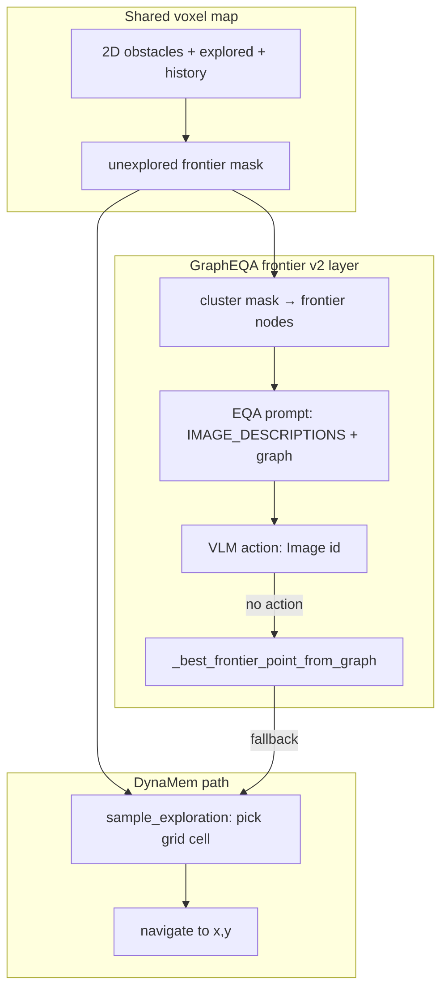

# HM-EQA exploration and prompting improvements

**Date:** 2026-06-03  
**Status:** In progress — P0 navigation fix + P4 ablation CLI/scripts landed 2026-06-03; ablation runs pending  
**Context:** Rescored Habitat runs (~40% on paper-comparable slices with local 3–4B VLMs) show infra/parser fixes were necessary but not sufficient for a clear win. Qwen2.5-VL-3B reached **50% on Q0–9**; frontier v2 regressed on Q0–19 (**5/20** vs paper **8/20**).  
**Related:** [HABITAT_EQA_HARNESS.md](HABITAT_EQA_HARNESS.md), [docs/habitat/usage.md](../habitat/usage.md), [docs/dynagraph.md](../dynagraph.md)

---

## Goal

Improve HM-EQA accuracy via **exploration** and **prompting** without degrading Robocasa / interactive GraphEQA / DynaMem behavior. Prefer surgical fixes (navigation index bug, Habitat-only prompts, config ablations) over broad refactors.

---

## Frontier: Dynamem (fluid map) vs GraphEQA (nodes)

Both stacks share the **same underlying voxel map and motion planner**. GraphEQA does **not** replace map-based exploration; it adds a **symbolic graph layer** on top for EQA prompts and routing fallbacks.

### Shared foundation: fluid 2D frontier mask

On every `update()`, the sparse voxel map builds a 2D grid (`obstacles`, `explored`, visit `history`). The **fluid frontier** is:

1. **Reachable free space** from the robot (`planner.get_reachable_points` flood-fill).
2. **Edge cells** of that region: `get_outside_frontier()` = reachable boundary minus interior (`get_edges(reachable) & ~reachable`).
3. **Unexplored frontier** = boundary cells not yet marked explored: `outside_frontier & ~explored`.

This mask changes every step as the map grows — it is continuous on the grid, not a fixed set of IDs.

**DynaMem** (`SparseVoxelMapNavigationSpace.sample_exploration` in `voxel_map_dynamem.py`) samples a **single grid cell** on that mask:

- **Time heuristic:** prefer frontier cells visited least recently (`history_soft` on the mask).
- **Keyword heuristic (optional):** when `graph_eqa_frontier_nodes.keyword_score_weight > 0`, blend in per-cell scores from nearby `image_descriptions` labels vs question keywords (`keyword_score_map`).
- Pick the max-scoring frontier cell closest to the robot; `sample_frontier()` returns world `(x, y)` for navigation.

No graph node is required for this path. Interactive `explore` / `run_exploration()` in DynaMem uses this fluid sampler.

### GraphEQA addition: discrete frontier **nodes**

When `graph_eqa_frontier_nodes.enabled: true` (default in `dynav_config.yaml`), `GraphEQAMemory.sync_frontier_nodes()` **mirrors** the same unexplored mask into the scene graph:

1. Cluster connected components on `unexplored` (`cluster_frontier_mask`, min 3 cells).
2. Keep up to `max_nodes` (12) clusters, ranked by keyword overlap with question-relevant objects.
3. For each cluster, upsert a graph node (`is_frontier=True`, labels like `frontier, table, …`) at the cluster centroid.
4. Expose these in **EQA prompts** via `IMAGE_DESCRIPTIONS` (“Image N … unexplored frontier”) and `SCENE_GRAPH` so the VLM can output `action: <image id>` to explore.
5. If the VLM gives no usable action, `GraphEQAController._best_frontier_point_from_graph()` navigates to the **best-matching frontier node** (discrete target) before falling back to `sample_frontier()` (fluid grid).



### What “paper baseline” vs “frontier v2” means in our sweeps

| Config | Frontier nodes | Navigation fallback |
|--------|----------------|---------------------|
| **Paper-style `graph_eqa`** | May be off or lightly used; EQA loop matches GraphEQA memory settings (`dynagraph_merge_xy_m=0`, `dynagraph_staleness_horizon=0`) | Primarily fluid `sample_frontier` + object-graph targets |
| **Frontier v2 experiments** (`frontier_v2_*` JSONL, `graph_eqa_frontier_nodes.enabled: true`) | Sync before each VLM call; frontier nodes in prompt; keyword_weight=2.0 | VLM image id → node nav → fluid frontier |

Frontier v2 adds **prompt surface area and routing indirection**. Regression on Q0–19 suggests mismatches between what the VLM sees (Image 1..N), what it selects (`action`), and where the robot actually goes — not necessarily a failure of the fluid map itself.

### Known bug: display index vs observation list index

`query_answer()` attaches images in **`obs_ids` order** (keyword-selected subset, max `eqa_max_images`). `parse_answer()` navigation uses `self._observations[image_id - 1]` (full list index). If the model says “go to Image 2,” the robot may navigate to the **wrong** observation. This likely hurts frontier v2 more than paper-style runs because frontier v2 relies on correct Image-id actions.

**Fix (P0):** resolve `action` image id through the same `obs_ids` list used for the prompt; add unit test in `test_graph_eqa_memory.py` or `test_habitat/`.

---

## Current evidence (2026-06-03, rescored)

| Run | Slice | Rescored accuracy |
|-----|-------|-------------------|
| Paper baseline (`graph_eqa_gemma3_paper_q0-112`) | Q0–9 | 4/10 (40%) |
| Paper baseline | Q0–19 | 8/20 (40%) |
| Paper baseline | Q0–112 | 46/113 (40.7%) |
| Qwen2.5-VL-3B fixed3 | Q0–9 | **5/10 (50%)** |
| Frontier v2 clean (gemma4, p20m10) | Q0–19 | 5/20 (25%) |

Parser fix changed only paper Q47 on the full set (−1 spurious A). Headline rankings unchanged.

**Interpretation:** Local 3–4B VLMs are competitive with our reproduced paper baseline; original GraphEQA paper used cloud Gemini/GPT (stronger). Gains are more likely from **routing + prompts + model choice** than from more frontier nodes alone.

---

## Implementation plan

### P0 — Navigation / action mapping (high leverage, low blast radius) — **done 2026-06-03**

**File:** `src/emet/memory/graph_eqa/graph_memory.py` — `_target_point_from_display_image_index`, `last_eqa_obs_ids`, test `test_display_image_index_maps_to_selected_obs_ids`.

---

### P1 — HM-EQA prompt variant (Habitat-only)

**Files:** `src/emet/llms/prompts/hmeqa_eqa_prompt.py`, `packages/emet_habitat/emet_habitat/runner.py` (or graph memory when `dataset=hmeqa`)

1. Habitat runs use **MCQ-only** examples (no yes/no from base `EQA_PROMPT` examples).
2. Explicit rule: `action` must be an integer **Image id from IMAGE_DESCRIPTIONS** (1..N) when `confidence: FALSE`.
3. Keep graph-coverage gate text aligned with `_graph_covers_relevant_objects()` override.

**Guardrail:** Robocasa / `emet run graph-eqa` keep existing prompt unless `--hmeqa-prompt` or env flag set.

---

### P2 — Image selection (no caption spam regression)

**File:** `graph_memory.py` (`_select_relevant_obs_ids`)

1. Diversify: at least one keyword match, one recent obs, one frontier-tagged obs when available.
2. Optional: raise `eqa_max_images` to 5–6 **only on last EQA iteration** when `confidence` still false (config flag).

**Guardrail:** `_get_image_descriptions_str` stays scoped to attached ids only (regression test in `test_frontier_nodes.py` / graph memory tests).

---

### P3 — Exploration budget gating

**Files:** `controller_graph_eqa.py`, `packages/emet_habitat/emet_habitat/runner.py`

1. Do **not** increase `max_planning_steps` / `max_movement_step` globally by default.
2. Optional: extra iteration only when `not confidence` and `not graph_memory._graph_covers_relevant_objects()`.
3. Log in JSONL: `exploration_reason` (`vlm_action` | `graph_frontier` | `fluid_frontier`).

---

### P4 — Frontier ablation matrix — **CLI + scripts ready 2026-06-03**

```bash
./scripts/run_habitat_frontier_ablation.sh
uv run python scripts/summarize_frontier_ablation.py --q-start 0 --q-end 19
```

| Arm | CLI | `enabled` | `keyword_score_weight` |
|-----|-----|-----------|------------------------|
| A — fluid | `--no-frontier-nodes --frontier-keyword-weight 0` | false | 0 |
| B — fluid_kw | `--no-frontier-nodes --frontier-keyword-weight 2` | false | 2 |
| C — nodes | `--frontier-nodes --frontier-keyword-weight 2` | true | 2 |

**Model:** Qwen2.5-VL-3B bf16 on **Q0–19**. Compare with `scripts/rescore_habitat_jsonl.py` or `summarize_frontier_ablation.py`.

---

### P5 — Two-tier VLM (optional, if VRAM allows)

**Files:** `eqa_vl_settings.py`, `vllm_factory.py`, habitat runner

- Small model: keywords, `extract_relevant_objects`, cheap captions.
- Same or larger model: final MCQ answer on last 1–2 iterations only.

Reuse shared VLM singleton; avoid duplicate loads (existing `graph_eqa_vlm.py` pattern).

---

## Testing

```bash
# Unit
uv run emet test src/test/habitat/test_metrics.py src/test/memory/test_graph_eqa_memory.py -q

# After P0: targeted graph EQA / action index test (add if missing)
uv run emet test src/test/memory/ -k "frontier or eqa_action or obs_ids" -q

# Smoke (GPU)
timeout 120 uv run emet run graph-eqa-habitat --dataset hmeqa --question-id 0 \
  --eqa-vl-family qwen2_5_vl --no-mock-llm --max-planning-steps 5

# Rescore
uv run python scripts/rescore_habitat_jsonl.py ~/.cache/habitat_eqa/results/<run>.jsonl \
  --q-start 0 --q-end 19 --show-flips
```

---

## Risks and guardrails

| Risk | Mitigation |
|------|------------|
| Habitat prompt changes leak to Robocasa | Gate on dataset / CLI flag |
| More images → VRAM / latency | Cap `eqa_max_images`; last-iter-only bump |
| Frontier nodes clutter graph | Keep `max_nodes` cap; paper arm with `enabled: false` |
| Over-exploration burns step budget | Confidence + graph-coverage gating (P3) |

---

## Suggested order of work

1. **P0** navigation index fix + tests  
2. **P4** ablation with Qwen2.5 Q0–19 (validates P0 + frontier hypothesis)  
3. **P1** HM-EQA prompt variant  
4. **P2** image selection  
5. **P3** budget gating  
6. **P5** two-tier VLM if still LLM-bound after exploration fixes  

---

## Iteration log (2026-06-09): experimental issues found + fixed

Iterated on a fixed random subset (seed 42: Q3,14,17,28,31,35,81,94 — note this sample is **D-heavy**, so guessing A scores only 1/8). Script: `scripts/run_habitat_iter_subset.sh` (time-limited via `timeout`).

### Issue 1 (major): HM3D semantics never populated the scene graph
- **Symptom:** scenes *with* HM3D semantic assets (Q3/14/17/28...) built **0 object nodes** (only a frontier node); scenes *without* semantics built 80+ via the VLM path. The best-info case was the worst-performing.
- **Root cause:** `controller_dynamem.py` gated the graph-update block on `sensor_builder is not None or use_instance_graph`. With semantics on, the runner sets `use_sensor_perception=False` (→ `sensor_builder=None`) and `use_instance_graph=False`, so the block — which contains the HM3D semantic→node path — was skipped entirely. The semantic labeler was never used.
- **Fix:** also enter the block when the robot exposes an `hm3d_semantic_labeler`; guard the `sensor_builder.world_xyz_for_observation` fallback against `sensor_builder=None` (`dynamem_graph_hooks.py`).
- **Effect:** Q3 went from 1 node / wrong (C) → **81 nodes / correct (B)**; all semantics scenes now build 64–81 object nodes. This bug had silently suppressed semantics on every run, including the paper batch (~1/3 of HM-EQA questions have semantic assets).

### Issue 2: caption/action runaway on the small VLM
- **Symptom:** Qwen2.5-VL-3B sometimes loops captioning non-existent images ("Image 26..40 shows a green chair") and exhausts the 512-token budget before emitting `answer:` → `parsed_answer_letter=''` (graded wrong).
- **Tried + reverted (1):** `repetition_penalty=1.3` + `no_repeat_ngram_size=3` → catastrophic thesaurus-mode degeneration that **broke a previously-correct case (Q3)**. Lesson: never use `no_repeat_ngram_size` with structured prompts.
- **Tried + reverted (2):** mild `repetition_penalty=1.15`. Looked fine on a 3-question probe, but on the full subset every answer drifted to "C". **Root cause:** the GraphEQA loop feeds prior iterations back through the `HISTORY` block, and HF's `repetition_penalty` also penalizes *input* tokens — so it pushes the model away from its own earlier answers and destabilizes the MCQ letter. Reverted to pure greedy (`repetition_penalty=1.0`) for both Qwen2.5 and Gemma4 clients.
- **Fix (kept):** a **letter-salvage retry** — when no `answer:` field is parsed, re-ask the VLM tersely for just the letter using the same images (`GraphEQAMemory._salvage_answer_letter`). Model-agnostic, fires only on blank answers (cannot perturb well-formed outputs), unit-tested. This recovers the runaway episodes without touching decoding.
- **Lesson:** an 8-question subset under (mildly nondeterministic) 3B greedy inference is too noisy to attribute single-question flips; only deterministic, mechanism-level fixes (semantics, salvage) are trustworthy at this sample size.

### Issue 3: unbounded EQA history bloated the prompt
- **Symptom:** every planning iteration appended its full output to `HISTORY`, and the whole list was prepended to the next prompt. Over ~20 iterations this becomes a huge prompt that feeds the model its own repeated outputs — a direct driver of the caption/action loops.
- **Fix:** cap to the most recent `eqa_vl.eqa_max_history` iterations (default 4) in `GraphEQAMemory.query_answer`.
- **Effect:** subset 2/8 → **3/8** (Q14 flipped wrong→correct); still 0 blanks. Smaller, faster prompts too.

### Issue 4: planning budget exhausted even when stuck (early-stop)
- **Observation:** the model returns `confidence: false` on essentially every iteration, so `run_eqa` only ever stops at the 20-step budget. That is fine while exploration is *productive* (graph keeps gaining nodes — e.g. Q3 grows to 81 nodes and answers correctly), but pure waste when the robot is stuck (no new nodes) and just re-asks with identical inputs.
- **Fix:** `DynamemController.run_eqa` early-stops after `eqa_stall_patience` (default 4) consecutive steps where the graph gained **no new nodes** *and* the answer is unchanged. Productive exploration always continues, so it never cuts a run still gathering evidence. Robot-agnostic; the agent's `query_memory` tool calls `query_answer` directly and is unaffected.

### Net result on the subset (Qwen2.5-VL-3B, 20 planning / 10 movement)
| arm | config | blanks | accuracy |
|---|---|---|---|
| iter1 | P0+P2, semantics **broken** | — | 1/4 (partial) |
| iter2 | + semantics fix | 2 | 1/8 |
| iter5 | + salvage retry (no penalty) | 0 | 2/8 |
| iter7 | + history cap | 0 | **3/8** |
| iter8 | + stall early-stop | 0 | 2/8 |

iter7 vs iter8 differ only in the (never-fired) early-stop, yet Q14 flipped correct→wrong — i.e. ±1 at n=8 is nondeterminism noise, not signal. The early-stop fired **0 times** on this subset because every scene explored productively (graph kept growing); it is a safety valve for stuck episodes, not a routine path. Trust the deterministic mechanism fixes (semantics, salvage, history cap); a stable accuracy delta needs a larger (≥30 q, letter-balanced) run.

### Issue 5: model ignored scene-graph memory; bigger model did NOT help
- **7B test:** Qwen2.5-VL-**7B** scored 2/6 vs 3B's 3/6 on the questions it finished (and was much slower). **Model size is not the bottleneck** on this task/subset.
- **Diagnosis (per-iteration answers):** the model returns the *same* letter ~19–20×/episode — it is internally consistent, not noisy, so answer aggregation/majority-vote cannot help. The smoking gun: Q28's graph contains a `red pillow` node, yet both 3B and 7B answer "None". The full `SCENE_GRAPH` references nodes by global `[Image N]` id, but only `eqa_max_images` images are attached (relabeled `Image 1..N`); the model answers from the attached images and ignores graph nodes it cannot currently see.
- **Fix:** `GraphEQAMemory._relevant_memory_summary()` prepends a concise `CONFIRMED_MEMORY` block listing question-relevant observed objects (counts + positions) and tells the model to trust them for existence/counting/location; it also states explicitly when a relevant object was never observed.
- **Effect:** Q17 ("did you see the woven basket") flipped from consistently wrong (C×19) → **correct (D)**; Q28's reasoning now engages the red pillow (still answers C, reasoning it is on a chair not the sofa — defensible). Headline stayed 3/8 because a borderline question (Q14, D:12/B:7 across iterations) flipped the other way — i.e. n=8 noise.

### Remaining (model-capability, not infra)
- Wrong-but-valid letters on hard questions (counting, state queries like "is the TV on", "is my son sleeping"). These are reasoning/ambiguity limits, not pipeline bugs.
- **Location questions need room/region context.** ~half this subset asks "where is X"; options are room names (living room, kitchen). The graph stores object xyz but no room labels, so the model cannot reliably map a position to a room. HM3D ships region annotations (`SemanticObject.region.category`), though coverage is uneven — a candidate next lever.
- **Exploration coverage.** Some targets (basket, treadmill, exercise mat, small red stool) were never observed despite ~56 planning steps; those questions are unanswerable from memory regardless of VLM.

### What moved the needle (ranked)
1. Semantics graph-population fix (deterministic; empty graph → 64–94 nodes) — by far the biggest.
2. Confirmed-memory summary (grounds existence/location in memory; fixed a consistently-wrong question).
3. History cap (less prompt bloat / self-echo).
4. Salvage retry (0 blanks).
5. Bigger VLM (7B): **no help** here.

### Issue 6: robot never explores toward unobserved targets
- **Diagnosis:** when not confident, `run_eqa_one_iter` navigated only to the VLM's "Navigate to Image N" target — an **already-observed** location. The VLM anchors on objects it has already seen and never directs the robot into new rooms, so targets it never observes (basket, treadmill, exercise mat, small red stool) stay unanswerable regardless of VLM quality.
- **Fix (`controller_dynamem.run_eqa_one_iter`):** while `_graph_covers_relevant_objects()` is False, override the navigation target with a keyword-biased unexplored frontier (`space.sample_frontier(..., text=relevant_objects)`); once the relevant objects are in the graph (or the VLM is confident) we follow its inspection target. Gated by `eqa_explore_when_uncovered` (default True). Also added a `target_point is None` guard (latent crash when a degenerate action parsed no image index).
- **Status:** implemented + unit tests green; **empirical validation blocked** — the shared GPU was saturated by other `home_robot_v2`/`v3` jobs (~14 GB), causing intermittent CUDA OOM and ~4–5× slowdown (1 episode in 18 min). Needs a clean GPU for a real coverage measurement.

### Issue 7: exploration override was in the wrong class (dead code) + caption-only grounding
- **Dispatch bug found:** `--method graph_eqa`/`dynagraph` uses `GraphEQAController(DynamemController)`, which **overrides** `run_eqa_one_iter` and calls `graph_memory.query_answer`. The Issue-6 exploration override had been added to `DynamemController.run_eqa_one_iter` — overridden, so it never ran for graph EQA (iter11's 4/8 came from the CONFIRMED_MEMORY summary + nondeterminism, not the frontier override). Moved the override into `GraphEQAController.run_eqa_one_iter` (reuses `_best_frontier_point_from_graph`, gated by `eqa_explore_when_uncovered`). Kept the `target_point is None` guard in the parent.
- **Caption-only grounding (the deeper issue, per Q17):** GraphEQA node labels come from a VLM caption/JSON prompt (`SensorGraphBuilder`), so a woven basket gets labeled "decorative plant" and existence/location answers are wrong even though the object was seen. But the voxel map already computes **SigLIP features** per observation (`voxel_dynamem.find_alignment_over_model`, `localize_text`) for open-vocab text→3D queries — unused by GraphEQA.
- **Fix:** `GraphEQAMemory.set_text_grounder()` + `GraphEQAController._siglip_text_match` (closure over the voxel map's SigLIP alignment). `_relevant_memory_summary` now reports, per relevant object, both graph-node matches and a SigLIP visual match (sim≥0.21 ⇒ PRESENT), so the VLM gets pixel-grounded existence/location independent of captions. Reuses already-computed features (just a text encode + matmul). Unit-tested; empirical validation pending a clean GPU window.

### Issue 8: keep GraphEQA a clean baseline; scope improvements to Dynagraph
- **Method split:** `--method graph_eqa` → `GraphEQAController` (**baseline**); `--method dynagraph` → `DynagraphController(GraphEQAController)` (**the contribution**; adds graph merge/staleness via `graph_memory.maintain`). My SigLIP grounding + exploration override had been added to the *baseline* class, contaminating it.
- **Fix:** gated the improvements behind flags that only Dynagraph turns on:
  - `GraphEQAMemory.memory_summary_enabled` (default False) gates the CONFIRMED_MEMORY block in `query_answer`.
  - `_text_grounder` (default None) — SigLIP grounder, set only by Dynagraph.
  - `_eqa_explore_when_uncovered` (default False in `GraphEQAController`, True in `DynagraphController`) gates the frontier-coverage override.
  - Shared robustness infra (semantics population fix, letter-salvage, history cap) stays ON for both so the baseline runs fairly.
- **Encoder caveat (important):** Habitat EQA builds controllers with `manipulation_only=True`, and `DynamemController` sets `self.encoder = None` in that mode ("depth voxel map for nav only — no SigLIP/YoloE reload per episode"). So the SigLIP grounder **no-ops in Habitat today** (returns None; CONFIRMED_MEMORY falls back to graph-node grounding). SigLIP grounding is active wherever the encoder is live (real-robot / non-manipulation dynamem). To use it in Habitat we must enable a (preferably shared, load-once) SigLIP encoder for Dynagraph — TODO.

### Issue 9: SigLIP live in Habitat + degeneration + image selection (the breakthrough)
- **Encoder enabled in Habitat:** added a shared, load-once `MaskSiglipEncoder` (`get_shared_mask_siglip_encoder`); `DynamemController._create_obstacle_map` honors `force_eqa_siglip_encoder` so SigLIP features are computed even in `manipulation_only` (feature compute is gated only on `encoder is not None`, not `manipulation_only`). `DynagraphController` sets the param before `super().__init__`. So SigLIP grounding + guided exploration are genuinely active for dynagraph in Habitat.
- **Startup crash fixed:** `DynagraphController._sync_ground_truth_from_session` called `robot.get_emet_session()` (sim-only) unconditionally in `__init__` → every Habitat episode errored at step 0 (`'HabitatRobotClient' object has no attribute 'get_emet_session'`). Now guarded with `getattr(...)` → returns 0 when absent.
- **VLM action degeneration fixed (applies to both methods):** the 3B VLM looped "navigate to image navigate to image …" to fill `eqa_max_tokens` (1024) every step → ~12 min/episode of mostly junk. Added `_RepetitionStop` (transformers `StoppingCriteria`) that halts on a short repeating tail cycle — no `repetition_penalty` (which penalized HISTORY input tokens). Result: ~2.5 min/episode (~5×) and clean Action lines.
- **SigLIP image selection (dynagraph only):** `GraphEQAMemory.set_obs_id_grounder` + `GraphEQAController._siglip_obs_id_for_text` (via `voxel_map.find_obs_id_for_text`). `_select_relevant_obs_ids` now force-includes the best-SigLIP-aligned observation per relevant object **first**, so the VLM is shown the actual target view even when it was captioned as something else (root cause of Q3: model described rug/couch/lamp, never the blanket/bed).
- **Head-to-head (8-q subset, Qwen2.5-VL-3B, greedy):** **dynagraph 4/8** (Q3,17,31,35) vs **graph_eqa baseline 3/8** (Q3,17,35). Both up from the original 2/8 (shared degeneration-stop). Dynagraph's extra win is **Q31** (9 frontier nodes explored — SigLIP-guided exploration + grounding). Tiny, D-skewed subset ⇒ directional, not conclusive.

### Recommended next steps
- A **larger, letter-balanced eval (≥30 q)** to measure real deltas — n=8 is noise-dominated.
- **Confidence calibration:** every episode runs to the full step budget (Confidence:False throughout); answers are correct via the final forced answer but early-stop never fires.
- **Room/region labels** on graph nodes for the many "where" questions.

### `run_agent.py` / multi-robot safety
- The controller graph-update gate now also fires when the robot exposes `hm3d_semantic_labeler`; for ZMQ/real robots (stretch, rby1, galaxea_r1, innate_mars) that attribute is absent (`getattr(...) is None`), so behaviour is unchanged.
- The early-stop lives in `run_eqa`, which the agent does **not** call (`query_memory` → `query_answer` directly). `query_answer` changes (P2 selection, salvage, history cap) are safe for the agent: salvage only fires on blank answers, the rest only reshape inputs.
- Repetition penalties were reverted to greedy, so no decoding change for any agent model.
- Verified: agent tests (`src/test/agent/`, 31 passed) + memory/metrics/llms suites green.

## Success criteria

- Qwen2.5 **Q0–19 ≥ 8/20** (match paper) with P0+P1, or explain failure mode from episode bundles.  
- Frontier v2 **not worse** than paper arm after P0 (target ≥ 8/20 on same slice).  
- No regression in `emet test src/test/habitat/` and graph memory unit tests.  
- Robocasa `emet run graph-eqa` smoke unchanged when Habitat-only flags off.
