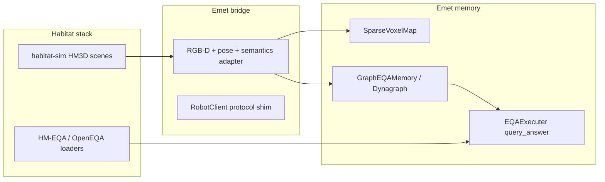

# Habitat EQA harness plan

Engineering plan for reproducing GraphEQA-style embodied question answering evaluation in Habitat-Sim, driving **emet** `GraphEQAMemory` / `DynagraphController` instead of the original GraphEQA ROS/Hydra stack.

**Status:** Scaffold implemented (`src/emet/habitat/`, `packages/emet_habitat/`, `emet run graph-eqa-habitat`). Full HM3D + batch eval requires `./scripts/install_habitat.sh` and downloaded assets.

**User docs:** [docs/habitat/README.md](../habitat/README.md) (install, data, Matterport API tokens, troubleshooting).

**Paper dependency:** Blocks `paper/sections/05_results.tex` until Habitat runs complete.

**Development branch:** `feature/habitat-eqa-harness`

---

## Goal

Same datasets and metrics as [GraphEQA](https://github.com/SaumyaSaxena/graph_eqa), but observations and actions flow through emet's memory and EQA executors:

- **HM-EQA:** 113 HM3D questions, scene init poses
- **OpenEQA:** Meta dataset subset per GraphEQA paper split

Methods to compare:

| Method | Config |
|--------|--------|
| GraphEQA baseline | `dynagraph_merge_xy_m=0`, `dynagraph_staleness_horizon=0` |
| Dynagraph | Default merge + staleness |
| Ablations | Per paper `04_experiments.tex` |

---

## Reference implementation

Study [SaumyaSaxena/graph_eqa](https://github.com/SaumyaSaxena/graph_eqa):

- `scripts/run_vlm_planner_hmeqa_habitat.py` / `grapheqa_hmeqa_habitat` config
- `scripts/run_vlm_planner_openeqa_habitat.py` / `grapheqa_openeqa_habitat`
- HM-EQA: 113 HM3D questions; `scene_init_poses`
- OpenEQA: Meta dataset download
- Docker split: Habitat-Sim image vs Stretch embodied image

---

## Architecture



---

## Engineering phases

| Phase | Work | Notes |
|-------|------|-------|
| **A. Environment** | `.venv-habitat` or `uv` extra `habitat`; pin `habitat-sim` / `habitat-lab` compatible with HM3D | Likely **separate venv** (like MolmoSpaces) due to numpy/CUDA conflicts with main `.venv` |
| **B. Assets** | HM3D scenes, HM-EQA JSON, OpenEQA subset, `scene_init_poses` | Document download scripts; mirror graph_eqa layout under `data/habitat_eqa/` |
| **C. Observation bridge** | Map Habitat agent sensors → emet `Observations` (rgb, depth, gps/compass or SE(3) pose, optional semantic) | [`src/emet/habitat/coordinates.py`](../../src/emet/habitat/coordinates.py): Habitat Y-up → voxel `(X, Z, Y-floor_y)`; OpenGL sensor → OpenCV cam pose |
| **D. Control bridge** | Map DynaMem nav actions (xyt, rotate_in_place, look_at) → Habitat velocity / discrete actions | Stretch agent in Habitat or locobot-style base |
| **E. Batch runner** | `emet run graph-eqa-habitat` or `scripts/run_hmeqa_batch.py` | Config flags: `--method graph_eqa\|dynagraph`, `--dataset hmeqa\|openeqa` |
| **F. Metrics** | Success rate, mean planning steps, optional LLM grader for OpenEQA | Match GraphEQA paper tables for direct comparison |
| **G. CI** | Smoke: 1 scene, 1 question, mocked mLLM | Full eval GPU-only, not default CI |

---

## Risks and mitigations

| Risk | Mitigation |
|------|------------|
| numpy / mujoco / habitat version hell | Isolated `.venv-habitat`; `install.sh --habitat` profile |
| Stretch-in-Habitat vs locobot agent mismatch | Start with same agent class GraphEQA paper used; document embodiment |
| Long HM-EQA runtime | Parallelize episodes; cache scene loads |
| Semantic segmentation differences vs original Hydra graphs | Acknowledge in paper; emet uses `SensorGraphBuilder` not Hydra—compare on EQA outcome metrics |

---

## Timeline relative to paper

1. **Parallel track 1:** `paper/` LaTeX scaffold on `paper/dynagraph-corl`.
2. **Parallel track 2:** This harness (phases A–F) — **blocks results section**.
3. **Parallel track 3:** Emet-EQA question banks for Robocasa/Molmo.
4. **Integrate:** Habitat + emet sim results into `05_results.tex`.

---

## Verification (when implemented)

```bash
# Smoke (mocked LLM)
RUN_HABITAT_TESTS=1 uv run emet test src/test/habitat/ -k smoke

# Single episode (confident mock — fast grading smoke)
uv run emet run graph-eqa-habitat --dataset hmeqa --scene-id 0 --question-id 0 --mock-llm

# Movement smoke (mock returns confidence:false each planning step)
.venv-habitat/bin/emet-habitat run-episode --question-id 3 --mock-llm --mock-llm-explore --max-planning-steps 5
```
